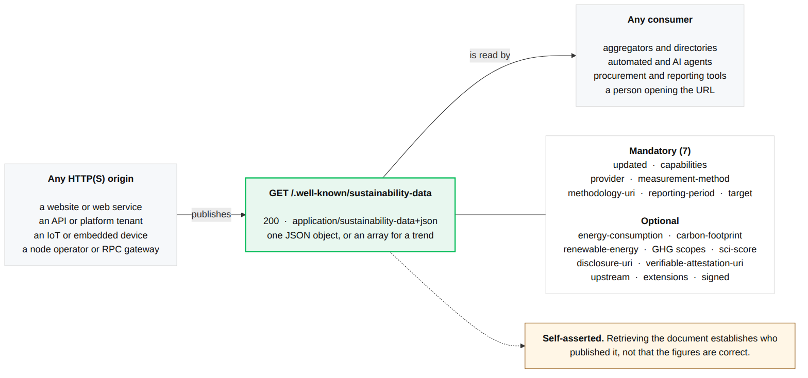
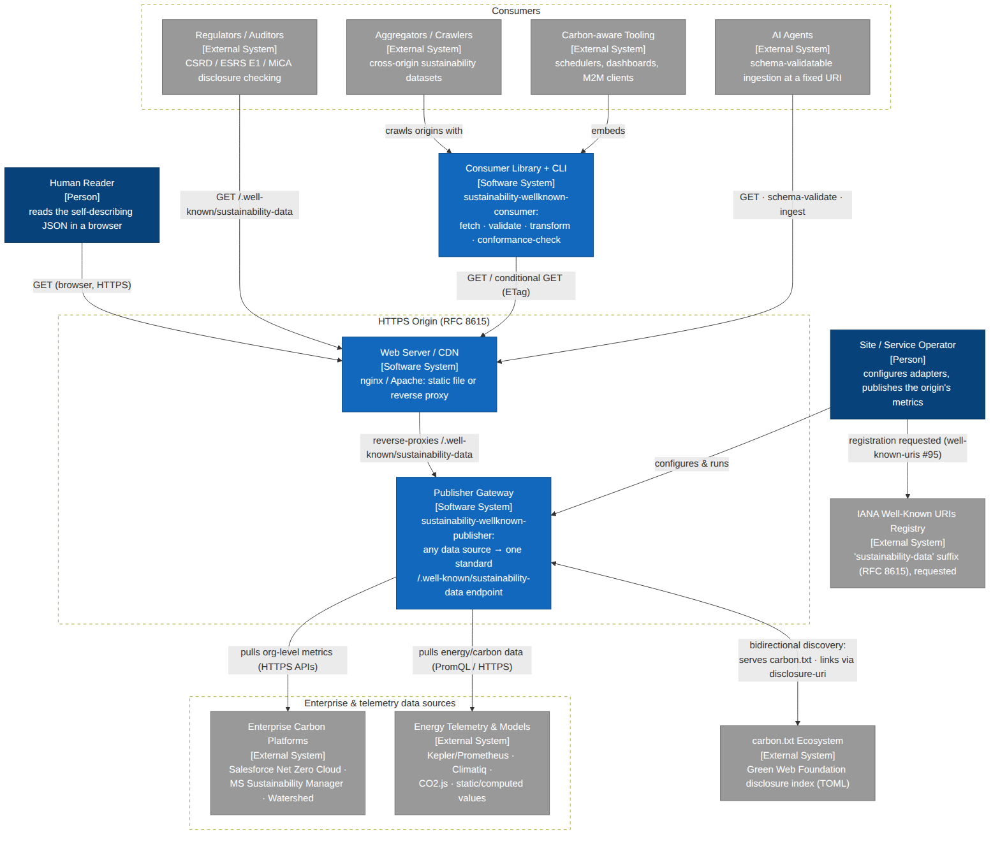

# Internet Draft Proposal
## IETF Internet-Draft (I-D)
### The 'sustainability-data' Well-Known URI

[](https://github.com/andreibesleaga/rfc-sustainability-wellknown/actions/workflows/full-verify.yml) [](https://www.npmjs.com/package/sustainability-wellknown-publisher) [](https://www.npmjs.com/package/sustainability-wellknown-consumer)

Datatracker: [draft-besleaga-sustainability-wellknown](https://datatracker.ietf.org/doc/draft-besleaga-sustainability-wellknown/)

**Author:** Andrei Nicolae Besleaga

**Status:** Individual Internet-Draft on the IETF **Independent Submission Stream**. Revision **-06** is the **latest posted** revision (posted 2026-09-10) and is **under ISE review** for publication as an Informational RFC; **-06 made no change to the wire format** relative to -05. Revision **-07** is being drafted in this repository — **not yet posted** to the Datatracker — and does make substantive wire-format changes (see [internet-drafts/](#internet-drafts) below and the `-07` draft's own Changelog appendix for the complete list). Revisions v02/v03 were discussed on the IRTF SUSTAIN mailing list and presented in the [SUSTAIN RG session at IETF 126](https://datatracker.ietf.org/meeting/126/session/sustain/) (Vienna); the research group has taken no position on the draft.

IANA well-known URI registration requested ([protocol-registries/well-known-uris#95](https://github.com/protocol-registries/well-known-uris/issues/95)); the requested suffix is `sustainability-data` as of revision `-04` (earlier revisions requested `sustainability`; no IANA action had occurred on that name).

This repository contains initial drafts and supporting documents, examples, sources, tooling, etc. Previous drafts are on the Datatracker and in this repository's git history; the internet-drafts folder keeps `-05`, `-06`, and `-07` (drafted in this repository, **not yet posted** to the Datatracker); system architecture with diagrams in: [architecture/](https://github.com/andreibesleaga/rfc-sustainability-wellknown/blob/main/architecture/README.md).

Reference testing gateway: https://sustainability.up.railway.app/ — one demonstration subject per publisher adapter (some fetch their upstream daily, the rest replay a recorded response), plus every example document from this repository; the gateway validates all of them with the published consumer library when it starts.

It also serves documents *about* real organizations. Those are **illustrative mappings prepared by the author** from each organization's own published reports: they are **not published, reviewed, authorized or endorsed by their reporting subjects**, who have not been contacted about them. Every such document says so in its `provider` member, and [gateway/README.md](gateway/README.md) and [gateway/data/README.md](gateway/data/README.md) record the source and retrieval date for each figure. They exist to exercise the format against real-world reporting shapes, not to speak for anyone.

---

## What this defines

> **The one distinction to hold onto:** the *origin* is **where** the document is
> published; the `target` member is **what** the metrics are about. For the common
> origin-wide case they coincide (the origin's host), but `target` may equally name
> an organization, a path, a cloud tenant, a device, or a data source.

A universal `/.well-known/sustainability-data` URI that allows any organization to publish reports, through a web server or digital service, with aggregated energy consumption and carbon footprint metrics, in a human and machine-readable, minimal, backward and forward compatible, extensible, JSON format.

**Not limited to conventional websites, and not limited to a server's own electricity bill.** 

A well-known URI is scoped to an HTTP(S) *origin* (RFC 8615) — any device or service that speaks HTTP can serve one alongside its normal API. That includes IoT and embedded devices (constrained devices already use the analogous well-known convention for discovery, e.g. CoAP's `/.well-known/core`, registered by RFC 6690) and Web3/Blockchain infrastructure — a RPC gateway, validator dashboard, or node operator's endpoint is an ordinary HTTP origin like any other. 



<sub>Source: [`architecture/diagrams/overview.mmd`](architecture/diagrams/overview.mmd) — every member name in the diagram matches [`schemas-validators/response-schema.json`](schemas-validators/response-schema.json).</sub>


Separately, the `provider` field names "the entity operating the origin," `measurement-method` is a token with RECOMMENDED machine-matchable values (or otherwise a short human-readable description), and the reference implementation's enterprise adapters (Salesforce Net Zero Cloud, Microsoft Sustainability Manager, Watershed) are written to publish *organization-level* figures through this same endpoint; they run in the gateway against recorded responses, none has been exercised against a live tenant, and the Microsoft adapter targets a preview API retired 2025-05-30. So it doubles as a discovery surface for the entity's regulatory reporting (CSRD, and analogues), not only a website's own hosting footprint. One concrete precedent: the EU's Markets in Crypto-Assets Regulation (MiCA) already mandates disclosure of a crypto-asset's consensus-mechanism energy consumption (and, above a threshold, renewable share, per-transaction energy intensity, and GHG emissions) — quantities this schema's optional fields already carry (with unit conversion), for an entity that is not a website at all.

Product and organization names are used only to identify the data sources these adapters read; they are trademarks of their owners and imply no affiliation or endorsement.

#### Why? (what it solves, how, and why now)

Sustainability data about digital services exists today — inside enterprise carbon platforms, annual PDF reports, cloud-billing dashboards, and regulatory filings — but there is **no universally known location to publish it and no common machine-readable shape to consume it**. Every consumer that wants the numbers (a regulator, an aggregator, a procurement team, a carbon-aware scheduler, an AI agent) must build a bespoke integration per provider, and most simply don't. Sometimes the gap is publication, sometimes measurement — and sometimes simply no agreed place to look.



**What it solves:**
* **Discovery** — today there is no agreed place to look for an organization's or service's environmental metrics; every provider that publishes at all invents its own URL, format, and access path.
* **Interoperability** — the data that does exist is trapped in incompatible vendor shapes (enterprise APIs, spreadsheets, PDFs), so it cannot be compared, aggregated, or acted on automatically.
* **Verifiability** — sustainability claims scattered across marketing pages are neither checkable nor comparable, which fuels greenwashing and erodes trust in the claims that are honest.

**How it solves it:**
* One **fixed, well-known URL per origin** (`/.well-known/sustainability-data`, per RFC 8615) — publishable by any HTTP origin, from a corporate portal to an IoT device, with no central authority and no per-site registration.
* One **minimal, formally specified JSON document** (CDDL (RFC 8610) and JSON Type Definition (RFC 8927) schemas; 7 mandatory + 19 optional members as of draft `-07`) with a declared reporting subject (`target`), wire-level unit defaults, and rules under which publishers emit only valid documents and clients ignore what they do not recognize — so every consumer reads every publisher without bespoke integration.
* A **mandatory methodology link** plus optional signed-attestation and disclosure links — claims arrive with their basis attached, checkable and comparable across providers.
* **Zero new protocol machinery** — plain HTTP GET, standard caching, CORS for browsers, forward-compatible extensibility — so the cost of adoption is one JSON file at a fixed URL.

**Why now:**
* **Regulation now requires the data to exist.** The EU CSRD/ESRS E1 (the EU sustainability reporting standard on climate) obliges tens of thousands of companies to produce audited energy and emissions figures; MiCA already mandates energy-consumption disclosure for crypto-asset providers (with renewable share and per-transaction intensity above 500,000 kWh/year); the EU Ecodesign regulation's Digital Product Passport extends disclosure to products. The numbers are being produced anyway — what's missing is a discoverable, machine-readable place to publish them.
* **The measurement gap is documented by the IAB itself.** RFC 9547 (the e-impact workshop report) records both the need for better data on the Internet's environmental impact and the absence of standardized ways to obtain it.
* **Carbon-aware computing needs machine-readable inputs.** Schedulers, load balancers, CDNs, and procurement tooling can only weigh environmental impact as a real constraint (alongside cost and latency) if the data is fetchable and schema-validated — not locked in PDFs.
* **The web has proven this exact pattern.** `robots.txt`, `security.txt` (RFC 9116), and carbon.txt show that a well-known, self-published file is the lowest-friction path to ecosystem-wide adoption — no central authority, no registration per site, no new protocol.
* **Fragmentation is already happening.** Enterprise platforms (Salesforce, Microsoft, Watershed), estimation APIs, and grid-intensity feeds each expose incompatible shapes; a neutral, vendor-independent schema lets them interoperate instead of competing on format.
* **Anti-greenwashing pressure demands verifiability.** A fixed location with a mandatory methodology link and optional signed attestations makes claims checkable — and comparable across providers — in a way scattered marketing pages never are.
* **AI agents and M2M consumers are here now.** A fixed, schema-validatable document that is safe to ingest without negotiation makes sustainability data usable by automated consumers the day it is published.

The regulatory disclosure wave (CSRD reporting cycles, MiCA, the Digital Product Passport) is rolling out now, and every organization it touches is deciding — this year, not eventually — how to expose its numbers. Without a neutral standard location, each platform, regulator, and vendor mints its own endpoint and format; once those ad-hoc choices ship and ecosystems build on them, converging later costs orders of magnitude more than agreeing first. The well-known registry exists precisely to pre-empt that fragmentation, and today it contains no sustainability entry at all: the anchor is missing at the exact moment the most publishers in history are looking for one. One provisional registry row now is cheap; unwinding a fragmented ecosystem later is not.

**Why this — nothing else does this, and this is the first and most complete proposal that could help** (every claim below was verified against the live IANA registry, the IETF Datatracker, and the adjacent projects' own materials, as of 2026-07-26):

* **Nothing in the IETF/IRTF space defines this.** No active or expired Internet-Draft or RFC specifies an application-layer sustainability disclosure format or well-known URI: the GREEN WG *excludes* carbon accounting and reporting by charter (its scope is network-device YANG management), and the adjacent expired drafts (sustainability-insights, green-metrics) were network-telemetry proposals with no disclosure endpoint. This draft is the only proposal of its kind on the Datatracker (as of 2026-07-26).
* **The nearest neighbor is complementary, not competing.** carbon.txt (Green Web Foundation) is a discovery *index* — a TOML file of links to disclosure documents, which is a disclosure index and carries no quantitative metrics. This proposal publishes the metrics themselves; the two specs cross-reference each other by design.
* **First in the registry.** The IANA Well-Known URIs registry has never contained a sustainability, carbon, green, energy, or ESG entry, and the only adjacent request in the queue, carbon.txt (issue #103, July 2026), is a disclosure index rather than a metrics document (see ADOPTION.md §13); this registration request (issue #95, June 2026) is the first for a metrics document.
* **Everything else is proprietary, regulated-filing-shaped, or advisory.** Enterprise carbon platforms (Salesforce, Microsoft, Watershed) expose per-vendor, authenticated APIs with incompatible shapes; regulatory formats (ESRS/XBRL filings, the DPP) are entity-level compliance documents, not web-discoverable machine endpoints; the W3C's Web Sustainability Guidelines are guidance, not a data format. None of them gives an arbitrary consumer a fetchable, validated document at a known URL.
* **Most complete by construction.** No other effort combines, in one specification: fixed-location discovery *and* the quantitative metrics themselves; a declared reporting subject that spans organizations, sites, paths, devices, cloud tenants, and products; a mandatory methodology link plus optional signed attestations; dual formal schemas (CDDL + JTD); full security *and* privacy treatment (consumer-side DoS bounds, path-disclosure defense, fingerprinting noise, consumer hardening); explicit legacy compatibility and collision-proof extensibility; and two interoperating open-source implementations proving both sides of the wire. It arrives with a running reference implementation.
* **Designed to stay compatible with later revisions and other formats.** The must-ignore rule plus the URI-keyed extension point mean any future metric (water use, hardware lifecycle, embodied carbon, whatever the next regulation demands) can be added by anyone, immediately, without touching the RFC or IANA: as of `-07`, a publisher packages such data as an object keyed by an absolute URI (RFC 3986) it chooses once — an `https` URI under its own control, which should identify documentation of the extension, or `urn:uuid:` plus a lowercase hyphenated UUID (RFC 9562) for a definer without a domain — inside the top-level `extensions` member — the top-level member set itself is now closed, and a consumer ignores an `extensions` entry, or any other top-level member, it does not implement. (Through `-06`, extensions instead used collision-proof reverse-domain member names directly at the top level, such as `com.example.pue`, with undotted names reserved for the specification, and a `version` label fixed at `"2.0"`; `-07` removes the `version` member entirely, since the media type and the must-ignore rule already do that job.) The same tolerance rules that absorb the future also absorb the past — historical documents remain readable by current clients. Publishing the RFC freezes the text, not the ecosystem: nothing that matters is locked in, and no deployed client is ever stranded.

#### Goals
* Provide a single, discoverable location, per origin, for environmental metrics about a declared reporting subject (`target` — by default the origin itself).
* Define a minimal, machine and human readable JSON structure, suitable for broad adoption.
* Ensure interoperability between clients and servers.
* Mitigate security and privacy risks associated with publishing the data.
* Provide an universal informational, backward and forward compatible schema, for reporting any sustainability data.
* Support alignment with GHG Protocol, EU CSRD, and other initiatives.

#### Non-Goals
* This document does not mandate a specific calculation or measurement methodology.
* It does not define the verification, validation, certificates, or attestation mechanisms, for the data itself, though it provides links to external attestations.
* It does not replace domain-specific reporting standards; it defines discovery and semantics and provides a discovery surface for linking to authoritative reports.

#### Readiness

By design (mirroring the draft's Introduction), the convention is usable, unchanged, in four consumption contexts:

* **Web-ready** — a plain HTTPS GET on a fixed well-known URI, with standard HTTP caching and conditional requests.
* **API/M2M-ready** — a stable JSON wire format with formal CDDL and JTD schemas and deterministic query and response semantics.
* **Human-readable** — self-describing member names plus a mandatory link to the measurement methodology.
* **AI/agent-ready** — machine-discoverable at a fixed location, schema-validatable, and safe to ingest without content negotiation or prior arrangement.

These are properties of the specification itself, not add-ons: any conformant document has all four at once.

---

### Adoption & publishing

* [ADOPTION.md](ADOPTION.md) — the multi-dimensional case (technical, regulatory, business, ecosystem, environmental) for adopting and approving this as an informational RFC and IANA registration.

#### Why the name `sustainability-data`

The well-known URI suffix was renamed from `sustainability` to `sustainability-data` in draft -04, following Independent-Stream review feedback on RFC 8615 §3, which asks registered names to be precise and discourages "squatting" on generic terms. The compound name registers the **specific application** — a machine-readable data document of sustainability metrics and disclosure links for a declared reporting subject — rather than claiming the generic concept, matching the registry's accepted descriptive-compound pattern (`security.txt`, `api-catalog`, `sbom`, `traffic-advice`). `-data` was chosen over `-metrics` because the specification permits a metrics-free document (a declaration MUST carry at least one numeric metric or at least one of `disclosure-uri`/`verifiable-attestation-uri`) and always carries non-metric content (methodology, disclosure index, attestation, `target-type`, extensions) — so "data" is the *accurate* description, and it scales to future environmental members. Names rejected: `sustainability-report(ing)` (collides with the CSRD/ESRS regulated term), `esg-metrics` (overclaims — no Social/Governance members), `carbon-*` (underclaims scope; blurs against the complementary carbon.txt), and framework-branded names (a neutral community convention should be org-independent). The IANA registry contains no sustainability/carbon/green/ESG entry and no third-party use of the path exists, so the registration creates the category's missing neutral anchor at the cost of one provisional row in an existing registry — removable if unused, promotable once in broad use, per RFC 8615 §3.1. The complete argued case with verified sources is in [ADOPTION.md §12](ADOPTION.md#12-the-name-why-sustainability-data--the-complete-registration-name-case).

--- 

## Repository Structure
The normative specification is the Internet‑Draft; this repo provides non‑normative examples, tooling, and documentation.

```
rfc-sustainability-wellknown/
├── internet-drafts/            # Draft sources (-05, -06, -07 in preparation), build script, changelog, VC companion note
├── example-responses/          # Valid JSON response examples (all validators pass)
├── schemas-validators/         # Formal schemas (CDDL, JTD) and validation tooling
├── example-scripts/            # Server-side security middleware + reference request handler (Python, JS, PHP), with tests
├── server-configurations/      # Web server configuration snippets (nginx, Apache)
├── publisher/                  # Reference publisher (TypeScript): adapters → conformant /.well-known/sustainability-data
├── consumer/                   # Reference client (TypeScript): fetch, validate, verify a /.well-known/sustainability-data document
├── gateway/                    # Reference multi-subject gateway (the live deployment: Extended self report, signed, attested)
├── architecture/               # System overview diagram and architecture notes
├── sfc-compliance/             # The SFC profile of this well-known URI: normative PROFILE.md, two reference declarations, and a checker
├── .github/                    # CI workflows (build, test, conformance battery, package publishing) and Dependabot policy
├── SIGNING-AND-ATTESTATION.md  # How to deploy the OPTIONAL signature and a Verifiable Credential (publisher, attester, consumer); covers -07's embedded `signed` member
├── ADOPTION.md                 # The case for RFC/IANA adoption (business, technical, regulatory benefits)
├── CONTRIBUTING.md             # How to build, test and change the draft or the packages
├── SECURITY.md                 # Vulnerability reporting and supported versions
├── CITATION.cff                # How to cite the specification
└── llms.txt                    # Machine-readable summary of the repository for AI assistants

```

---

## internet-drafts/

Draft in multiple formats plus supplementary documents.

| Revision (files kept: `-07`, `-06`, `-05`; earlier ones on the Datatracker) | Description |
|---|---|
| `draft-besleaga-sustainability-wellknown-07.md` | **In preparation — not yet posted** to the Datatracker; drafted in this repository, next after the latest posted revision (`-06`). Withdraws the companion `sustainability-data.jws` resource and its detached signature in favor of an OPTIONAL `signed` member embedded in each declaration object (a JWS over the object itself, typed by `cty`); removes the `version` member entirely (seven mandatory members remain); moves private extension data out of top-level reverse-domain names into a top-level `extensions` object keyed by absolute URI (RFC 3986; an `https` URI the definer controls, or a `urn:uuid:` name) and closes the top-level member set; adds an OPTIONAL `upstream` member chaining to the declarations of providers a subject's figures derive from (bounded consumer-side walk, depth at most 3); replaces the old condition that a metric-less document's `methodology-uri` be openly retrievable with a plain rule that a declaration MUST carry at least one numeric metric or one of `disclosure-uri`/`verifiable-attestation-uri`; gives Extended Query Parameters a formal ABNF grammar and a 7-step numbered processing procedure; removes the server-side 366-object cap in favor of a consumer-side bound; removes the `X-Content-Type-Options: nosniff` recommendation; and adds a worked-deployment appendix in which the attestation's `credentialSubject` carries the derivation model behind the figures — its constants and formulas — rather than a byte hash, an issuer attesting one period's figures carrying a copy of that declaration instead (the draft constrains no credential format). See the draft's own Changelog appendix for the complete list |
| `draft-besleaga-sustainability-wellknown-07.xml` / `.txt` | xml2rfc v3 XML (authoritative submission form) and rendered text of `-07`, kept in this repository ahead of posting |
| `draft-besleaga-sustainability-wellknown-06.md` | **Latest posted revision** (posted 2026-09-10, under ISE review) — responds to the ISE's second round (security designed in from the start) and to the first commissioned review: requests registration of, and requires, the `application/sustainability-data+json` media type, makes HTTPS a MUST, adds an OPTIONAL detached-JWS signature mechanism and a threat-model table, adds "Roles and Processing Model" and "Partial Knowledge and Incremental Adoption", and fixes the `version` label as a single value. No change to the wire format |
| `draft-besleaga-sustainability-wellknown-06.xml` / `.txt` | xml2rfc v3 XML (authoritative submission form) and rendered text of `-06` |
| `draft-besleaga-sustainability-wellknown-05.md` | Prior posted revision (posted 2026-07-28) — responds to the ISE's initial review of `-04`: removes the carbon.txt-path reference from `disclosure-uri` (now format- and location-agnostic), adds an Internationalization Considerations section, states the calendar-period rationale in-document, and recognizes the calendar year as the common Basic-service reporting cycle. No change to the wire format |
| `draft-besleaga-sustainability-wellknown-05.xml` / `.txt` | xml2rfc v3 XML and rendered text of `-05` |
| `draft-besleaga-sustainability-wellknown-04.md` | Prior posted revision — renames the requested URI suffix to `sustainability-data` (resolving the IANA naming feedback), adds the optional `target-type` member, places the `version` value space under change control, and defines the reverse-domain extension-member naming rule |
| `draft-besleaga-sustainability-wellknown-04.xml` / `.txt` | xml2rfc v3 XML (authoritative submission form) and rendered text of `-04` |
| `draft-besleaga-sustainability-wellknown-03.*` | Previous revision — posted to the Datatracker 2026-07-23; breaking data-model revision, schema label `"2.0"` |
| `draft-besleaga-sustainability-wellknown-02.*` | Previous submitted revision (posted 2026-07-03) |
| `draft-besleaga-sustainability-wellknown-01.*` | Previous revision (posted 2026-07-02) |
| `draft-besleaga-sustainability-wellknown-00.*` | Earlier revision |
| `draft-besleaga-green-sustainability-wellknown-05/04/03/02/01/00.*` | Earlier revisions (previous name) |
| `draft-verifiable-credential.md` | Supplementary: W3C Verifiable Credential structure for anti-greenwashing attestations |

`-05`, `-06`, and `-07` are kept as files in this directory (`-07` **in preparation, not yet posted**);
the rows above `-05` are the revision history, whose sources were removed once posted and remain available on the
[Datatracker](https://datatracker.ietf.org/doc/draft-besleaga-sustainability-wellknown/)
and in this repository's git history.

The current draft (`-07`, in preparation) defines the full data model, mandatory/optional fields, CDDL and JTD formal schemas, security, privacy, and internationalization considerations, and IANA registration request.

---

## example-responses/

22 JSON response files covering every service level and every member defined in the draft, including the OPTIONAL `signed` (one file was signed once, with a throw-away key, so that the served signature is real and verifies). All pass both CDDL and JTD validation.

| File | Description |
|---|---|
| `example-response.json` | Basic service — single object, aggregate host metrics |
| `example-response-extended.json` | Extended service — single object, every optional field but `upstream` and `signed`, including GHG scopes, `verifiable-attestation-uri`, `disclosure-uri` (market-based) and a URI-keyed `extensions` object |
| `example-response_yearly.json` | Extended service — array of 12 monthly objects for a full year trend (location-based) |
| `example-response-yearly-monthly-target.json` | Extended service — array scoped to a specific path prefix, echoed in the mandatory `target` member |
| `example-response-unreported.json` | Partial reporting — demonstrates metric omission (the only "not reported" mechanism the format defines) and the default units (`kWh`/`gCO2e`), with a `disclosure-uri` pointer |
| `example-response-organization.json` | Organization-level reporting (`target-type: "organization"`) — a synthetic corporate GHG inventory in the shape a real one takes: Scope 1/2/3 in `mtCO2e`, the three scopes summing to `carbon-footprint`, location-based accounting. Every value is invented; no real organization is named. |
| `example-response-comprehensive.json` | Comprehensive organization report (`target-type: "organization"`) for a fictional data-centre operator — every optional member that fits an organization, plus six `https`-keyed `extensions` carrying what the base format does not define: ISO/IEC 30134 facility KPIs (PUE/REF/ITEU/ERF/CER/WUE) and CUE, water, waste, hardware circularity, refrigerant and generator emissions, and renewable procurement. Every figure is invented and internally coherent (the scopes sum to `carbon-footprint`; `carbon-intensity-gCO2e-per-kWh` times `energy-consumption` is `scope-2`). |
| `example-response-origin-annual.json` | Basic service — annual origin-level report (`target-type: "origin"`), the primary real-world static-file use case: no query parameters, one calendar year |
| `example-response-service.json` | Basic service — SaaS `target-type: "service"` annual report, with `sci-score`/`functional-unit` |
| `example-response-product.json` | Basic service — hardware product carbon disclosure (`target-type: "product"`), Digital Product Passport style, per-unit lifecycle `functional-unit` |
| `example-response-device.json` | Basic service — IoT/edge node with hardware-metered energy (`target-type: "device"`), demonstrating a URI-keyed `extensions` member |
| `example-response-tenant.json` | Basic service — cloud tenant allocation (`target-type: "tenant"`, `measurement-method: "cloud-billing"`), full Scope 1/2/3 |
| `example-response-data-source.json` | Basic service — metrics-feed/data-source report (`target-type: "data-source"`) |
| `example-response-minimal.json` | Minimum-conformance example — the 7 mandatory members plus `disclosure-uri`, the minimum evidence a declaration may carry in place of a numeric metric |
| `example-response-organization-trend.json` | Basic service — 4-year annual trend array (2022-2025, `target-type: "organization"`), demonstrating array ordering/non-overlap/uniformity rules |
| `example-response-upstream-organization.json` | The downstream half of the `-07` `upstream` pair — an organization naming the tenant-scoped declaration of the cloud provider its figures partly derive from |
| `example-response-upstream-tenant.json` | The upstream half of the pair — what that provider states it delivered to one tenant (`target-type: "tenant"`, an opaque `target`), the only shape the draft defines a comparison for |
| `example-response-upstream-multiple.json` | Several `upstream` entries with different roles — `cloud` and `cdn` name tenant-scoped declarations about this customer (comparable), `electricity` names the supplier's own totals (no comparison defined); each entry is compared on its own |
| `example-response-signed.json` | The OPTIONAL `signed` member, real and verifiable: an EdDSA JWS whose payload is the object without `signed`, `cty: sustainability-data+json`, public key in the header as `jwk`. The origin is an internationalized host, so `target` and every URI carry its A-label (`xn--grn-ioa.example`) while `provider` is UTF-8 text |
| `example-response-removals.json` | A negative scope — `scope-1` nets 320 t of inventoried removals against 140 t of direct emissions, as the draft allows where the accounting method conveys removals; `carbon-footprint` stays gross (140 + 400 + 700 = 1240), so the scopes as published no longer sum to it and the methodology document explains why. Also a free-text `measurement-method`, an omitted `energy-unit` (kWh applies) and an attestation link for the removals claim |
| `example-response-daily-trend.json` | Extended service — a `daily` series for a metered device, in watt-hours and grams: the response to `?period=2026-03&granularity=daily` for the three days held. The same month requested without `granularity` is `404`: three days do not cover March, so no honest aggregate exists |
| `example-response-aggregate.json` | What the Extended aggregation rule produces: the answer `example-response_yearly.json` gives to `?period=2025` when it holds only months — energy and carbon summed in the last entry's unit, `capabilities: "extended"`, `renewable-energy` omitted (a percentage is not a sum), `carbon-accounting` kept because every month agrees |

---

## schemas-validators/

Formal schemas and validation tooling. See [schemas-validators/README.md](schemas-validators/README.md) for full setup and usage.

| File | Description |
|---|---|
| `response-schema.json` | JTD (RFC 8927) schema |
| `response-schema.cddl` | CDDL (RFC 8610) schema — matches the formal definition in the draft |
| `validator-json.py` | Validates a JSON file against the JTD schema; handles single objects and arrays |
| `validator-cddl.py` | Validates a JSON file against the CDDL schema using the `cddl` Ruby gem |
| `validate-all.sh` | Runs both validators against all files in `example-responses/` |
| `requirements.txt` | Python dependencies (`jtd`) |
| `install.py` | Installs all dependencies: `jtd` via pip, `cddl` via gem |

**Quick start:**
```bash
cd schemas-validators/
python3 install.py
./validate-all.sh
```

---

## example-scripts/

Server-side security middleware implementing the operational safeguards from the draft's Security and Privacy sections, plus a full reference request handler. Zero dependencies, for broad adoption.

| File | Description |
|---|---|
| `security.py` | Python — DoS cap, sub-daily filter, optional deterministic ~1% noise |
| `security.js` | JavaScript (Node, zero dependencies) — same three safeguards |
| `security.php` | PHP — same three safeguards + `Content-Type: application/sustainability-data+json` header |
| `request-handler.py` | Complete, zero-dependency (`http.server`) reference request handler: query-parameter parsing, Basic/Extended routing, single-object-vs-array shape, conditional requests, 404/405 — verified end-to-end against both schema validators |
| `test_security.py` / `.js` / `.php` | Unit tests for the corresponding `security.*` safeguards file |
| `test_request_handler.py` | End-to-end tests for `request-handler.py` (golden/error/edge-case paths, schema-validated) |
| `README.md` | Endpoint spec, service levels, mandatory safeguards, caching, validation field table |

**The draft's operational safeguards** (draft §Security / §Privacy):

| Safeguard | Detail |
|---|---|
| **DoS protection** | As of `-07`, the specification bounds only the *consumer* (it MUST limit the bytes and objects it accepts); the earlier `-06` server-side "cap at 366 objects" MUST/RECOMMENDED rule is removed. `security.py`/`.js`/`.php` still cap published arrays at 366 entries (one leap year of daily data), keeping the most recent periods, as a server-side defense-in-depth measure, not a spec requirement |
| **Traffic analysis prevention** | Drop entries whose `reporting-period` is not a calendar day, month or year (the draft says publishers SHOULD NOT report finer than 24 hours; a longer string is malformed) |
| **Anti-fingerprinting** (optional) | ~1% multiplicative (sign-preserving) noise on `energy-consumption`, `carbon-footprint`, `scope-1/2/3`, applied once at generation time, deterministic per reporting period, consistent across related fields — non-negative members stay non-negative, and negative scope values keep their sign |

---

## server-configurations/

Drop-in configuration snippets for serving `/.well-known/sustainability-data`. See [server-configurations/README.md](server-configurations/README.md) for setup instructions.

| File | Description |
|---|---|
| `nginx.conf` | Nginx `location` block: media type, caching, CORS, method restriction, rate limiting (commented) |
| `apache.conf` | Apache `Alias` + `<Location>` block: same features, rate limiting options (commented) |
| `README.md` | Setup instructions, feature comparison table, security notes |

Both configurations implement:
- `Content-Type: application/sustainability-data+json` (MUST)
- `Cache-Control: public, max-age=86400` (RECOMMENDED)
- `ETag` / `Last-Modified` (auto, RECOMMENDED)
- `Access-Control-Allow-Origin: *` for browser-based aggregator access (successful responses SHOULD carry it, per the draft's CORS recommendation)
- GET/HEAD-only method restriction (other methods get `405` with `Allow: GET, HEAD`)
- Rate limiting snippet (commented — activate for dynamic `period`/`granularity` parameters)

---

## Key data model fields

The data model is **7 mandatory and 19 optional members (26 total)** as of draft `-07`
(in preparation, not yet posted). It was **8 mandatory and 16 optional (24 total)** from `-04`
through `-06` (`-06` changed no member at all); `-07` removes the `version` member, adds
`upstream` and `extensions`, and turns the signature into an OPTIONAL `signed` member
embedded on the declaration object itself (previously a separate detached-JWS resource, not
a payload member). The authoritative definitions, with every requirement level, are in the
draft itself — this README does not restate them, so the two cannot drift apart:

* **Member definitions** — draft `-07`, "Payload Format (JSON Data Model)".
* **Formal schemas** — [`schemas-validators/response-schema.cddl`](schemas-validators/response-schema.cddl)
  and [`response-schema.json`](schemas-validators/response-schema.json) (JSON Type Definition).
  These are identical to the draft's own blocks and to both packages' embedded copies (the embedded TypeScript copies are equal to the JSON schema as JSON values; the CDDL and JSON files are byte-identical);
  CI checks that equality on every push.
* **Worked documents** — [`example-responses/`](example-responses/), one per service level,
  all validated against both schemas in CI.

Four properties are worth knowing before you read any of that, because they shape everything
else:

* **Omission is the only "not reported" mechanism.** There is no in-band sentinel. A member
  that is present always carries a real value; a metric you cannot stand behind is left out.
* **The document asserts, it does not verify.** Retrieving it establishes who published it,
  nothing more. `disclosure-uri` and `verifiable-attestation-uri` are the composable path to
  independent verification, and the reference consumer never follows them automatically.
* **Unknown members must be ignored.** A consumer ignores a top-level member it does not
  recognize, which is how a later revision reaches a deployed client without stranding it.
  As of `-07`, the top-level member set is
  closed — a publisher MUST NOT add other top-level members — and private extension data
  instead lives inside the OPTIONAL top-level `extensions` object, keyed by an absolute URI
  (RFC 3986) the definer chooses once — an `https` URI under its own control, which should
  identify human-readable documentation of the extension, or `urn:uuid:` plus a lowercase
  hyphenated UUID (RFC 9562) for a definer without a domain. A key is an identifier compared
  as a string and is never dereferenced, and there is no registry. (Through `-06`, extensions
  used top-level reverse-domain names such as `com.example.pue`, with undotted names reserved
  for the specification.)
* **The reporting subject is declared, not inferred.** The mandatory `target` member says what
  the figures describe — an origin, a subdomain, a service, a device, a tenant, a product, or
  the organization itself.

## Compatibility between draft revisions

The wire document itself is **byte-identical** across `-04`, `-05`, and `-06`: no
member has been added, removed, renamed, or retyped, and the CDDL and JTD schemas in
`schemas-validators/` were unchanged across those three revisions. `-06` changed only what sits around the document:
it requests registration of the `application/sustainability-data+json` media type in the standards
tree and requires it for successful responses, makes HTTPS a MUST for both publication
and retrieval (including every redirect hop), and adds an OPTIONAL detached-JWS
signature mechanism (see the `-06` draft's "Document Integrity and Signing" section).

**`-07` (in preparation, not yet posted) is not wire-compatible with `-04`–`-06`.** It
removes the `version` member (seven mandatory members remain, not eight); withdraws the
companion `sustainability-data.jws` resource and the detached-signature mechanism in favor
of an OPTIONAL `signed` member embedded directly in each declaration object; replaces
top-level reverse-domain extension members with a URI-keyed top-level `extensions` object
and closes the top-level member set; adds an OPTIONAL `upstream` member for chaining to the
declarations of providers a subject's figures derive from; drops the old condition that a
metric-less document's `methodology-uri` resource be openly retrievable, in favor of a plain
rule that a declaration MUST carry at least one numeric metric or one of
`disclosure-uri`/`verifiable-attestation-uri`; gives Extended Query Parameters a formal ABNF
grammar and a numbered processing procedure; removes the server-side 366-object cap in favor
of a consumer-side bound; and removes the `X-Content-Type-Options: nosniff` recommendation.
The CDDL and JTD schemas in `schemas-validators/` already reflect `-07`. See the draft's own
Changelog appendix in
[`draft-besleaga-sustainability-wellknown-07.md`](internet-drafts/draft-besleaga-sustainability-wellknown-07.md)
for the complete list.

Reference-implementation behavior since `0.6.0`: `consumer/` sends
`Accept: application/sustainability-data+json, application/json;q=0.9`, accepts both
media types, exposes a `mediaType` field on the result, and its conformance battery
reports a publisher still serving the legacy `application/json` as **WARN**, not
**FAIL**, until the RFC and IANA registration land. `publisher/` emits the new
registered media type by default and offers a `mediaType: "json"` legacy option
(v05-compatible, not v06-conformant).

Reference-implementation behavior in `0.6.5`-`0.6.7`, superseded by `0.7.0` below: the
OPTIONAL parts of `-06` were exercised end to end, all opt-in. `publisher/` signed its
document (detached JWS at `/.well-known/sustainability-data.jws`, EdDSA or ES256, over the
exact bytes served; `keygen`/`sign` CLI subcommands; `signAttached()` for a `vc+jwt`
credential) and `consumer/` verified it (`--verify`, a battery check that passed on *absent*,
never turned a failure into "false") and could verify a linked W3C Verifiable Credential
2.0 (`--verify-attestation`). All JOSE work is delegated to `jose`. The reference
gateway signs its own report, links a credential attesting its reporting *model*
(issued by the same person who operates it, and saying so), serves that report at
the draft's Extended service level, and rate-limits the well-known URI; relayed
third-party documents stay unsigned and unattested by design.

Reference-implementation behavior since `0.7.0` (the current release, accompanying `-07`):
`publisher/` embeds the `signed` JWS directly in each declaration object instead of serving
a separate `.jws` resource, drops the `version` member, supports the OPTIONAL `upstream`
member, and moves private extension data into the URI-keyed top-level `extensions` object.
`consumer/` verifies the embedded `signed` member, walks `upstream` declarations to a depth
of at most three while refusing revisited URIs, and no longer checks for `nosniff`, which the
specification no longer recommends.

---

## Anti-greenwashing: Verifiable Credentials

The OPTIONAL `verifiable-attestation-uri` member MAY link to a signed attestation, such as a W3C Verifiable Credential issued by a third-party auditor.

An example structure is documented in [internet-drafts/draft-verifiable-credential.md](internet-drafts/draft-verifiable-credential.md).

What this does and does not give you: the signature covers the figures **inside the attestation**, not the document served at the well-known URI. Retrieving the document establishes only that the origin published it. A consumer wanting assurance must fetch the attestation as well and compare the values itself. Nothing here makes a self-asserted figure true.

How to deploy it — and the draft's other optional mechanism, a `signed` member embedded in each declaration object as of `-07` (through `-06`, a separate detached signature of the served bytes at `/.well-known/sustainability-data.jws`) — as a publisher, an attester or a consumer, in a few commands each: [SIGNING-AND-ATTESTATION.md](SIGNING-AND-ATTESTATION.md). The reference gateway runs both live.

---

## Reference implementation (publisher/)

Published on npm: **[`sustainability-wellknown-publisher`](https://www.npmjs.com/package/sustainability-wellknown-publisher)** (`npm install sustainability-wellknown-publisher`). The `0.1.0` release on the registry implements the historical `-02` / schema-`1.1` model; the `0.4.0` release implements the schema-`2.0` model then current (revision `-04`; neither `-05` nor `-06` made any schema change, and `-07` later retired the `"2.0"` label along with the `version` member — see below). `0.5.0` and `0.5.2` are version-only bumps keeping the two packages in lockstep — the publisher's code is unchanged from `0.4.0`. `0.6.0` implemented `-06` (dedicated media type, HTTPS, `nosniff`) while staying `-05` compatible via the `mediaType: "json"` option, `0.6.5` added the OPTIONAL detached JWS signature and the `vc+jwt` attestation, `0.6.6` completed the Extended selection rule (an array only for a granularity finer than the period; aggregation; calendar-checked periods), HEAD/GET header parity under Express, and the `https` check on URI members, and `0.6.7` exposed the validators to browser clients, bounded upstream bodies, and passed Climatiq's required data-version selector. **`0.7.0` implements draft `-07`** (in preparation, not yet posted) and **`0.7.1` is the current release**, differing from it only in that an unmatched `target` now receives the same 404 body as a period with no data, as the draft asks: it drops the `version` member and the companion `.jws` resource, embeds the OPTIONAL `signed` JWS directly in each declaration object, supports the OPTIONAL `upstream` member, and moves private extension data into the URI-keyed top-level `extensions` object.

[publisher/](publisher/) is a reference TypeScript implementation that publishes a fully draft-conformant `/.well-known/sustainability-data` document. It ingests metrics from pluggable source adapters — static/computed values, Kepler/Prometheus energy telemetry, the Climatiq estimate API, **Green Web Foundation CO2.js (bytes → carbon)**, the **Green Web Foundation carbon.txt hosted API**, and enterprise suites (Salesforce Net Zero Cloud, Microsoft Sustainability Manager, Watershed) — normalizes them to the draft's field model, **validates every payload against this repo's JTD and CDDL schemas before serving** (publish-only-if-valid), and exposes the Basic and Extended service levels with the draft's mandated DoS/privacy safeguards. It can also **serve a bidirectional `carbon.txt`** that points back to the metrics document. It ships as Express and Fastify middleware plus a standalone server that any web server can reverse-proxy. See [publisher/README.md](publisher/README.md) and [publisher/USAGE.md](publisher/USAGE.md).

## Reference implementation (consumer/)

Published on npm: **[`sustainability-wellknown-consumer`](https://www.npmjs.com/package/sustainability-wellknown-consumer)** (`npm install sustainability-wellknown-consumer`). As with the publisher, `0.1.0` on the registry implements the `-02` / schema-`1.1` model; the `0.4.0` release implements the schema-`2.0` model then current (revision `-04`; neither `-05` nor `-06` made any schema change, and `-07` later retired the `"2.0"` label along with the `version` member — see below). `0.5.0` fixed a CLI argument-parsing bug found while verifying the first live deployment, and `0.5.2` added path-prefixed base URLs (the multi-subject gateway pattern) — see the note under "Verify a live deployment" below. `0.6.0` required the `-06` media type (reporting a pre-`-06` `application/json` document as a WARN, not a failure), refused plain HTTP unless `--allow-http` is given, and checked for `nosniff`; `0.6.5` added `--verify` for the OPTIONAL detached JWS and `vc+jwt` attestation, and the battery's signature check; `0.6.6` checked every redirect hop before requesting it, completed the enumerated-member tolerance, and reported the final URL; `0.6.7` derived the `target-type` list from one place. **`0.7.0` is the current release**, implementing draft `-07`: it verifies the embedded `signed` member instead of a separate `.jws` resource, walks `upstream` declarations (bounded to a depth of three, refusing revisited URIs), no longer checks for `nosniff`, and updates the enumerated-member tolerance and battery checks for the seven-mandatory-member model.

Both packages are additionally mirrored on GitHub Packages, under the owner scope that registry requires ([`@andreibesleaga/sustainability-wellknown-publisher`](https://github.com/andreibesleaga/rfc-sustainability-wellknown/pkgs/npm/sustainability-wellknown-publisher), [`@andreibesleaga/sustainability-wellknown-consumer`](https://github.com/andreibesleaga/rfc-sustainability-wellknown/pkgs/npm/sustainability-wellknown-consumer)); npmjs.com remains the canonical registry.

[consumer/](consumer/) is a reference **client** for `/.well-known/sustainability-data`, complementing `publisher/`'s reference producer: fetch, defensively validate (JTD schema plus the draft's cross-entry array rules, since a non-conformant upstream server is the normal case for early ecosystem adoption), and transform (CSV, NDJSON, a flattened one-row-per-metric shape, trend aggregation) a document from any origin. It ships a zero-dependency one-call function (`fetchSustainability`) and a richer `SustainabilityClient` class for repeated, ETag-cached polling, plus a `sustainability-fetch` CLI whose `--strict` mode doubles as a standalone conformance checker usable against **any** implementation, not just this repo's own `publisher/`. Its `interop.test.ts` — a live, in-process round trip against a real `Publisher` instance — is concrete, running proof of the draft's client-side MUSTs (accept both response shapes; ignore unknown top-level members, the pre-`-07` `version` among them); the packages' own tolerance for historical `1.x` documents (a rule `-06` no longer specifies) is covered in `fetch.test.ts` and `transform.test.ts`. See [consumer/README.md](consumer/README.md) and [consumer/USAGE.md](consumer/USAGE.md).

Both packages, at 0.7.0, are exercised together by the reference gateway's test suite and its live deployment.

## Verify a live deployment

Once a `/.well-known/sustainability-data` document is deployed anywhere — this repo's
reference implementation or a third party's — verify it with the same four checks used
to confirm the reference deployment at [`https://andreibesleaga.com/.well-known/sustainability-data`](https://andreibesleaga.com/.well-known/sustainability-data):

```bash
# 1. correct media type + CORS + caching
curl -sI https://example.org/.well-known/sustainability-data | grep -Ei 'HTTP/|content-type|cache-control|access-control'

# 2. valid JSON, correct content
curl -s https://example.org/.well-known/sustainability-data | python3 -m json.tool

# 3. full conformance battery (works against any implementation)
npx -y -p sustainability-wellknown-consumer sustainability-fetch https://example.org --strict

# 4. any linked methodology/disclosure pages actually resolve
curl -sI https://example.org/sustainability-methodology.html | head -1
```

Full walkthrough, expected output, and the `--strict` severity model (a failed `MUST`
is `FAIL`; an unmet `SHOULD` — e.g. a static host that cannot add an `Allow` header to
its own `405` — is `WARN` and does not fail the check) are in
[consumer/README.md § Verify a live deployment](consumer/README.md#verify-a-live-deployment).
That section also has the version note: this requires consumer `0.5.0` or later.

## Supporting material (non-normative)

* [sfc-compliance/PROFILE.md](sfc-compliance/PROFILE.md) — the normative SFC profile of this well-known URI: four criteria, two declaration levels (network and operator), three extension names under `https://andreibesleaga.com/sfc/extensions/`, six rules a publisher can get wrong, and what a conformance statement may and may not claim. Beside it, [`sfc-compliance/examples/`](sfc-compliance/examples) holds two reference declarations and `sfc-compliance/sfc-check.mjs` is a checker built on the published consumer library. The profile constrains a publisher claiming it; it changes nothing in the draft, adds no top-level member and invents no unit.
* [sfc-compliance/SFC.md](sfc-compliance/SFC.md) — the older, non-normative note mapping this draft's members onto the author's own Sustainability-First Consensus (SFC) framework. It is the author's work, not an independent endorsement of this draft.

The product-discovery notes and the deployment research logs that informed earlier revisions are working material, not part of the specification, and are no longer carried in the repository. Their conclusions are in the draft and in `ADOPTION.md`.


## CHANGELOG

Changes and updates between versions of the draft are documented (summarized) in [internet-drafts/CHANGELOG.md](internet-drafts/CHANGELOG.md). The reasons behind the `-07` changes, with their migration and reversal costs, are in [internet-drafts/REVISION-07-RATIONALE.md](internet-drafts/REVISION-07-RATIONALE.md).

--- 

## Citation

If you reference this project or implement the specification in your academic or professional work, please cite the IETF Internet-Draft:

**Plain Text (APA):**
> Besleaga, A. N. (2026). *The 'sustainability-data' Well-Known URI* (Internet-Draft draft-besleaga-sustainability-wellknown). Internet Engineering Task Force. https://datatracker.ietf.org/doc/draft-besleaga-sustainability-wellknown/

---

## LICENSE

Copyright (c) 2026 IETF Trust and the persons identified as the document authors (for Drafts).

[BSD 3-Clause License](./LICENSE) (for any other software parts and supporting files in this repository).

Copyright 2026 Andrei Nicolae Besleaga. Licensed under the BSD 3-Clause License.
