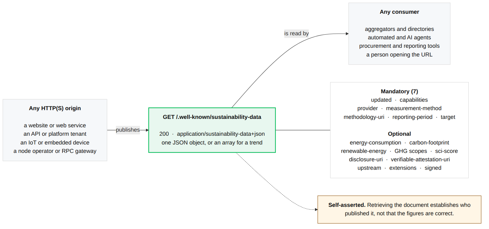

# The 'sustainability-data' Well-Known URI
## IETF Internet-Draft (Independent Submission)

[](https://github.com/andreibesleaga/rfc-sustainability-wellknown/actions/workflows/full-verify.yml) [](https://www.npmjs.com/package/sustainability-wellknown-publisher) [](https://www.npmjs.com/package/sustainability-wellknown-consumer)

Datatracker: [draft-besleaga-sustainability-wellknown](https://datatracker.ietf.org/doc/draft-besleaga-sustainability-wellknown/)

**Author:** Andrei Nicolae Besleaga

**Status:** an individual Internet-Draft on the IETF Independent Submission Stream, proposed as an Informational RFC. The latest posted revision, `-07` (2026-09-17), is under review by the Independent Submissions Editor and has received an ART-area early review; the answers are in `-08`, prepared in this repository and not yet posted. An IANA well-known URI registration is requested ([protocol-registries/well-known-uris#95](https://github.com/protocol-registries/well-known-uris/issues/95)) and parked until the draft is adopted on a stream. Revision history: [internet-drafts/README.md](internet-drafts/README.md) and [internet-drafts/CHANGELOG.md](internet-drafts/CHANGELOG.md); the registration and naming case: [ADOPTION.md](ADOPTION.md).

Presented at the IRTF Sustainability Research Group (IETF 126, July 2026); Independent Submission under review.

---

## What this defines

> **The one distinction to hold onto:** the *origin* is **where** the document is
> published; the `target` member is **what** the metrics are about. For the common
> origin-wide case they coincide (the origin's host), but `target` may equally name
> an organization, a path, a cloud tenant, a device, or a data source.

A universal `/.well-known/sustainability-data` URI that allows any organization to publish reports, through a web server or digital service, with aggregated energy consumption and carbon footprint metrics, in a human and machine-readable, minimal, backward and forward compatible, extensible, JSON format.

**Not limited to conventional websites, and not limited to a server's own electricity bill.**

A well-known URI is scoped to an HTTP(S) *origin* (RFC 8615) — any device or service that speaks HTTP can serve one alongside its normal API. That includes IoT and embedded devices (constrained devices already use the analogous well-known convention for discovery, e.g. CoAP's `/.well-known/core`, registered by RFC 6690) and Web3/Blockchain infrastructure — a RPC gateway, validator dashboard, or node operator's endpoint is an ordinary HTTP origin like any other.



<sub>Source: [`architecture/diagrams/overview.mmd`](architecture/diagrams/overview.mmd) — every member name in the diagram matches [`schemas-validators/response-schema.json`](schemas-validators/response-schema.json).</sub>

**What it solves.** Sustainability data about digital services exists today, inside enterprise carbon platforms, PDF reports, billing dashboards and regulatory filings, but there is no agreed place to look for it and no common machine-readable shape to read it, so every consumer builds a bespoke integration per provider, and most build none.

**How.** One fixed URL per origin, one minimal JSON document with formal schemas (CDDL, RFC 8610; JSON Type Definition, RFC 8927), a declared subject (`target`), a mandatory methodology link, optional signed-attestation and disclosure links, and plain HTTP GET with standard caching and CORS. Publishers emit only valid documents; clients ignore what they do not recognize.

**Why now.** Regulation (the EU CSRD/ESRS E1, MiCA, the Digital Product Passport) already obliges organizations to produce these figures; carbon-aware schedulers and automated consumers need them in a fetchable, schema-validated form; and the well-known registry has no sustainability entry, so each platform is inventing its own endpoint. The longer version, with the adjacent work and the reasons this draft is the first of its kind, is in [ADOPTION.md](ADOPTION.md).

**Goals.** A single discoverable location per origin for environmental metrics about a declared subject; a minimal machine- and human-readable JSON structure; interoperability between clients and servers; mitigation of the security and privacy risks of publishing the data; a backward and forward compatible schema for any sustainability data; alignment with the GHG Protocol, EU CSRD and other initiatives.

**Non-goals.** It does not mandate a calculation or measurement methodology; it does not define verification, certificates or attestation mechanisms for the data itself (it links to external attestations); it does not replace domain-specific reporting standards, it defines discovery and semantics and a surface for linking to authoritative reports.

**Readiness.** One unchanged document is web-ready (a plain HTTPS GET with standard caching), API/M2M-ready (a stable wire format with formal schemas), human-readable (self-describing member names plus the methodology link) and AI/agent-ready (fixed location, schema-validatable, safe to ingest without negotiation).

Organization-level figures and regulatory reporting (CSRD and analogues, MiCA's crypto-asset energy disclosures) are in scope: `provider` names the entity operating the origin, and the reference publisher's enterprise adapters (Salesforce Net Zero Cloud, Microsoft Sustainability Manager, Watershed) publish organization-level figures through the same endpoint; they run against recorded responses only (detail in [ADOPTION.md](ADOPTION.md#2-technical-benefits)). Product and organization names are used only to identify the data sources these adapters read; they are trademarks of their owners and imply no affiliation or endorsement.

**Why the name `sustainability-data`.** The compound name registers the specific application, a machine-readable data document of sustainability metrics and disclosure links for a declared subject, as RFC 8615 Section 3 asks, rather than the generic term. The name is still to be discussed with the IANA reviewer; the full argued case is in [ADOPTION.md section 12](ADOPTION.md#12-the-name-why-sustainability-data--the-complete-registration-name-case) and [section 14](ADOPTION.md#14-naming-round-2-proper-name-options-and-precedents).

---

## The live gateway

Reference testing gateway: https://sustainability.up.railway.app/ — it runs the draft end to end. It serves one demonstration subject per publisher adapter plus three of the gateway's own, every example document from this repository, and its own report; some demonstrations fetch their upstream daily, the rest replay a recorded response. Every document is produced by the published publisher library and validated by the published consumer library at start-up; a failure stops it from starting.

The gateway also serves illustrative mappings of real organizations' own published figures, prepared by the author, served only where the source's terms allow reuse, not endorsed by anyone, and removable on request ([gateway/LEGAL.md](gateway/LEGAL.md); sources and retrieval dates in [gateway/data/README.md](gateway/data/README.md)).

### What the live gateway shows

| | |
|---|---|
| **Real organisations** | Figures transcribed from each organisation's own report, with the source document, retrieval date and licence recorded per figure. Served only where the source's terms allow reuse; seven are withheld: six because their terms forbid reuse, one (Fastly) because its terms could not be read. |
| **Every case in the draft** | 22 wire-format examples: every `target-type`, unit, accounting basis, period precision, trend shape, negative scope, upstream chain, both kinds of extension name, and one really signed declaration. |
| **Every adapter** | Eleven demonstrations (Kepler/Prometheus, NESO grid intensity, CO2.js, carbon.txt, Climatiq, Salesforce Net Zero Cloud, Microsoft emissions, Watershed, the IETF GREEN power-and-energy YANG model, the Green Web Foundation's DIST file, and an experimental, synthetic ledger example). Each shows **its raw input next to the declaration it becomes** at `/{domain}/input`, with the licence and a live-upstream link where one exists. |
| **Its own report** | Extended service: any period since go-live, sliced monthly or daily, following the draft's seven-step query procedure. Energy from the host's usage metrics where entered (else a stated assumption), the Netherlands grid factor (EEA), an embedded `signed` member, and a Verifiable Credential attesting the model. |
| **HTTP behaviour** | The dedicated media type, strong ETags and `304`s, CORS, `405` with `Allow`, identical `404`s for unknown prefixes and missing data, rate limiting, and a legal notice with a removal route. |
| **For people** | A plain-language page that follows the system light/dark theme, with captioned tables, keyboard-scrollable regions and a link for every request it advertises. |
| **Check any origin** | `/validate?origin=https://host` fetches an origin's declaration once with the published consumer and says whether it is a schema-valid declaration; `/badge/<host>.svg` shows the same result as a README badge. At most one fetch per host per hour, `https` and public names only, a stricter limit for checks that cause a fetch, a `503` with `Retry-After` when the service's own budget is spent, no result stored, an exclusion list for operators who ask. A check describes the bytes served at that moment; it is never an endorsement. |

[`tools/report-to-declaration/`](tools/report-to-declaration/) turns a published PDF or HTML report into a
**candidate** declaration through any OpenRouter model. A figure survives only if its quote is found in the
source and the number is inside that quote. Conflicting values and targets are refused. Nothing says it was
checked until a named reviewer approves it.

### Publish it on your own site

Everything needed to serve `/.well-known/sustainability-data` from the platform you already use, each piece
tested the way its platform expects. Details and the verification status of each recipe:
[deploy/README.md](deploy/README.md).

| You run | Use | How it is verified |
|---|---|---|
| A static host (Cloudflare Pages, Netlify, Vercel, Render, AWS S3 + CloudFront, Google Cloud, Azure) | the header file or policy in [`deploy/static/`](deploy/static/); a Terraform module and a CLI script for AWS; honest notes where a host cannot do it (GitHub Pages, Shopify, Squarespace, Webflow) | Terraform `fmt` and `validate` in CI; the rest reviewed |
| A web server or proxy (nginx, Apache or LiteSpeed via `.htaccess`, Caddy, HAProxy, Envoy, Traefik, IIS) | the few lines in [`deploy/proxies/`](deploy/proxies/) | nginx, Apache and Caddy started and checked in strict mode in CI; HAProxy configuration-checked |
| An application (Express, Fastify, Koa, Next.js, Nuxt, SvelteKit, Astro; Flask, FastAPI, Django; PHP, Laravel, Symfony; Go; Spring Boot; ASP.NET Core; Rails; Axum) | one route in [`deploy/frameworks/`](deploy/frameworks/), or the publisher library for a signed, Extended service | ten servers started in CI, each checked for every MUST of the draft, `405` with `Allow`, `HEAD` like `GET`, `ETag`/`304` |
| WordPress | the plugin [Sustainability Data (well-known)](deploy/wordpress/): a settings page that checks what you enter, a signed declaration, multisite, translation-ready, no external calls (GPLv2-or-later) | WordPress coding standards, PHP 8.1 compatibility, offline tests, and a run in a real WordPress in Docker checked by the consumer |
| Nothing yet | `npx create-sustainability-data`: seven questions, the file and your host's configuration ([`tools/create-sustainability-data/`](tools/create-sustainability-data/)) | tests, including the command run the way `npx` runs it |
| A container platform (Railway or any other) | the one-click node in [`deploy/one-click/railway/`](deploy/one-click/railway/): figures from environment variables, served and signed by the publisher library | tests; the image built and run |
| A home energy meter | the Home Assistant add-on in [`deploy/home-assistant/`](deploy/home-assistant/): a signed monthly `hardware-metered` declaration from the Energy dashboard's sensor, never a partial month | tests against a simulated Home Assistant; not yet run on a real instance |
| A spreadsheet or an ESG tool's export | the publisher's `csvAdapter`: one row per period, every cell checked, an unusable row reported and never published | publisher tests |
| An HPC cluster (Slurm) | the publisher's `slurmSacctAdapter`: monthly energy from `sacct` job accounting | publisher tests |
| CI for any of the above | the GitHub Action in [`deploy/github-action/`](deploy/github-action/): validates a file or a live origin | this repository runs it on itself |

### Adoption and deployments

* [IMPLEMENTATIONS.md](IMPLEMENTATIONS.md) — the software that implements the draft and the origins known to serve the document, checked daily ([`implementations.json`](implementations.json), seven origins, all operated by the author); says who operates each one.
* [ADOPTION.md](ADOPTION.md) — the case (technical, regulatory, business, ecosystem, environmental) for adopting this as an Informational RFC and for the IANA registration.

---

## Reference implementation (publisher/)

[publisher/](publisher/) publishes a draft-conformant `/.well-known/sustainability-data` document. It is on npm as
**[`sustainability-wellknown-publisher`](https://www.npmjs.com/package/sustainability-wellknown-publisher)**; the
current release, **`0.7.3`**, implements draft `-07`.

- **What it does:** takes figures from pluggable adapters, normalises them to the draft's members, validates every
  document against this repository's JTD and CDDL schemas before serving it (nothing invalid is published), and
  serves the Basic and Extended service levels with the draft's safeguards. It can sign each declaration (the
  embedded `signed` member) and serve a matching `carbon.txt` that points back to the document.
- **Adapters:** static and computed values, Kepler/Prometheus, Climatiq, Green Web Foundation CO2.js and carbon.txt
  API, Salesforce Net Zero Cloud, Microsoft Sustainability Manager, Watershed, a CSV adapter for any ESG tool's
  export, and Slurm `sacct` for HPC energy.
- **How to run it:** Express or Fastify middleware, or a standalone server behind any web server. Usage, options and the
  version history: [publisher/README.md](publisher/README.md) and [publisher/USAGE.md](publisher/USAGE.md).

## Reference implementation (consumer/)

[consumer/](consumer/) reads `/.well-known/sustainability-data` from any origin. It is on npm as
**[`sustainability-wellknown-consumer`](https://www.npmjs.com/package/sustainability-wellknown-consumer)**; the
current release, **`0.7.0`**, implements draft `-07`.

- **What it does:** fetches, validates defensively (schema plus the draft's cross-entry rules), verifies the embedded
  `signed` member, walks `upstream` declarations (depth three at most, no URI twice), and transforms a document to
  CSV, NDJSON, one row per metric, or trend aggregates.
- **How to use it:** one function call, a client class for repeated polling, or the `sustainability-fetch` CLI, whose
  `--strict` mode is a conformance checker for any implementation. API, CLI and the version history:
  [consumer/README.md](consumer/README.md) and [consumer/USAGE.md](consumer/USAGE.md).

Both packages are also mirrored on GitHub Packages; npmjs.com is the canonical registry. The reference gateway's
tests and its live deployment use both together.

## Verify a live deployment

Once a `/.well-known/sustainability-data` document is deployed anywhere, this repository's reference
implementation or a third party's, verify it with the same four checks used for
[`https://andreibesleaga.com/.well-known/sustainability-data`](https://andreibesleaga.com/.well-known/sustainability-data):

```bash
# 1. correct media type + CORS + caching
curl -sI https://example.org/.well-known/sustainability-data | grep -Ei 'HTTP/|content-type|cache-control|access-control'

# 2. valid JSON, correct content
curl -s https://example.org/.well-known/sustainability-data | python3 -m json.tool

# 3. full conformance battery (works against any implementation)
npx -y -p sustainability-wellknown-consumer sustainability-fetch https://example.org --strict

# 4. any linked methodology/disclosure pages actually resolve
curl -sI https://example.org/sustainability-methodology.html | head -1
```

The walkthrough, the expected output, the `--strict` severity model (a failed `MUST` is `FAIL`; an unmet `SHOULD`
is `WARN` and does not fail the check) and the consumer version needed for a `-07` document are in
[consumer/README.md § Verify a live deployment](consumer/README.md#verify-a-live-deployment).

---

## Repository Structure
The normative specification is the Internet‑Draft; this repo provides non‑normative examples, tooling, and documentation.

```
rfc-sustainability-wellknown/
├── internet-drafts/            # Draft sources (-05, -06, -07 posted; -08 prepared), build script, changelog, VC companion note
├── example-responses/          # Valid JSON response examples (all validators pass)
├── schemas-validators/         # Formal schemas (CDDL, JTD) and validation tooling
├── example-scripts/            # Server-side security middleware + reference request handler (Python, JS, PHP), with tests
├── server-configurations/      # Web server configuration snippets (nginx, Apache)
├── publisher/                  # Reference publisher (TypeScript): adapters → conformant /.well-known/sustainability-data
├── consumer/                   # Reference client (TypeScript): fetch, validate, verify a /.well-known/sustainability-data document
├── gateway/                    # Reference multi-subject gateway (the live deployment: Extended self report, signed, attested)
├── tools/report-to-declaration/ # Demonstration: a published report → a candidate declaration, verbatim quotes, human approval
├── deploy/                     # Copy-paste deployment recipes for hosts, servers and frameworks, each CI-run one validated in strict mode
├── bdd/                        # Behaviour scenarios for every normative sentence of the draft (cucumber-js), with the traceability check
├── fitness/                    # Architecture fitness functions: cross-package rules kept as tests
├── architecture/               # System overview diagram and architecture notes
├── sfc-compliance/             # The SFC profile of this well-known URI: normative PROFILE.md, two reference declarations, and a checker
├── .github/                    # CI workflows (build, test, conformance battery, package publishing) and Dependabot policy
├── SIGNING-AND-ATTESTATION.md  # How to deploy the OPTIONAL signature and a Verifiable Credential (publisher, attester, consumer); covers -07's embedded `signed` member
├── ADOPTION.md                 # The case for RFC/IANA adoption (business, technical, regulatory benefits)
├── IMPLEMENTATIONS.md          # Implementations and live deployments (RFC 7942 style); implementations.json is the checked list
├── scripts/test-everything.sh  # Builds and tests every area in one run, from a clean clone
├── CONTRIBUTING.md             # How to build, test and change the draft or the packages; support and governance
├── CODE_OF_CONDUCT.md          # Contributor Covenant 2.1
├── SECURITY.md                 # Vulnerability reporting and supported versions
├── CITATION.cff                # How to cite the specification
└── llms.txt                    # Machine-readable summary of the repository for AI assistants

```

System architecture, with C4 diagrams: [architecture/README.md](architecture/README.md).

---

## internet-drafts/

The draft in Markdown, xml2rfc XML and rendered text, plus supplementary documents. The directory keeps the posted
`-05`, `-06` and `-07` and the prepared `-08`; earlier revisions are on the
[Datatracker](https://datatracker.ietf.org/doc/draft-besleaga-sustainability-wellknown/) and in this repository's
git history. The full revision history is in [internet-drafts/README.md](internet-drafts/README.md).

| File | Description |
|---|---|
| `draft-besleaga-sustainability-wellknown-08.md` | **Prepared, not posted.** Editorial: an RFC 7942 Implementation Status appendix, the worked example aligned with the live deployment, and the answers to the ART-area early review of `-07`. No change to the format, the schemas, the media type or the registration |
| `draft-besleaga-sustainability-wellknown-07.md` / `.xml` / `.txt` | **Latest posted revision** (posted 2026-09-17, under ISE review). Defines the full data model, mandatory and optional members, CDDL and JTD schemas, security, privacy and internationalization considerations, and the IANA registration request |
| `draft-besleaga-sustainability-wellknown-06.*`, `-05.*` | Prior posted revisions, kept as files for reference |
| `draft-verifiable-credential.md` | Supplementary: W3C Verifiable Credential structure for anti-greenwashing attestations |
| `CHANGELOG.md`, `REVISION-07-RATIONALE.md` | Changes between every revision; the reasons behind the `-07` changes, with their migration and reversal costs |

**Compatibility between the last two revisions.** `-07` and `-08` have the same wire format: the same seven mandatory
and nineteen optional members, the same schemas in `schemas-validators/`, the same media type. The current
library releases (`0.7.x`) implement it: the embedded `signed` member, `upstream` walked to depth three, and
URI-keyed `extensions`. The consumer still accepts the generic `application/json` with a WARN while the media type
registration is pending, and the publisher can emit it with `mediaType: "json"` (not conformant). What earlier revisions
changed, and which library releases implemented them, is in [internet-drafts/README.md](internet-drafts/README.md#compatibility-between-draft-revisions-moved-from-the-root-readme-2026-10-09).

---

## example-responses/

22 JSON response files covering every service level and every member defined in the draft, including the OPTIONAL `signed` (one file was signed once, with a throw-away key, so that the served signature is real and verifies). All pass both CDDL and JTD validation.

| File | Description |
|---|---|
| `example-response.json` | Basic service — single object, aggregate host metrics |
| `example-response-extended.json` | Extended service — single object, every optional field but `upstream` and `signed`, including GHG scopes, `verifiable-attestation-uri`, `disclosure-uri` (market-based) and a URI-keyed `extensions` object |
| `example-response_yearly.json` | Extended service — array of 12 monthly objects for a full year trend (location-based) |
| `example-response-yearly-monthly-target.json` | Extended service — array scoped to a specific path prefix, echoed in the mandatory `target` member |
| `example-response-unreported.json` | Partial reporting — demonstrates metric omission (the only "not reported" mechanism the format defines) and the default units (`kWh`/`gCO2e`), with a `disclosure-uri` pointer |
| `example-response-organization.json` | Organization-level reporting (`target-type: "organization"`) — a synthetic corporate GHG inventory in the shape a real one takes: Scope 1/2/3 in `mtCO2e`, the three scopes summing to `carbon-footprint`, location-based accounting. Every value is invented; no real organization is named. |
| `example-response-comprehensive.json` | Comprehensive organization report (`target-type: "organization"`) for a fictional data-centre operator — every optional member that fits an organization, plus six `https`-keyed `extensions` carrying what the base format does not define: ISO/IEC 30134 facility KPIs (PUE/REF/ITEU/ERF/CER/WUE) and CUE, water, waste, hardware circularity, refrigerant and generator emissions, and renewable procurement. Every figure is invented and internally coherent (the scopes sum to `carbon-footprint`; `carbon-intensity-gCO2e-per-kWh` times `energy-consumption` is `scope-2`). |
| `example-response-origin-annual.json` | Basic service — annual origin-level report (`target-type: "origin"`), the primary real-world static-file use case: no query parameters, one calendar year |
| `example-response-service.json` | Basic service — SaaS `target-type: "service"` annual report, with `sci-score`/`functional-unit` |
| `example-response-product.json` | Basic service — hardware product carbon disclosure (`target-type: "product"`), Digital Product Passport style, per-unit lifecycle `functional-unit` |
| `example-response-device.json` | Basic service — IoT/edge node with hardware-metered energy (`target-type: "device"`), demonstrating a URI-keyed `extensions` member |
| `example-response-tenant.json` | Basic service — cloud tenant allocation (`target-type: "tenant"`, `measurement-method: "cloud-billing"`), full Scope 1/2/3 |
| `example-response-data-source.json` | Basic service — metrics-feed/data-source report (`target-type: "data-source"`) |
| `example-response-minimal.json` | Minimum-conformance example — the 7 mandatory members plus `disclosure-uri`, the minimum evidence a declaration may carry in place of a numeric metric |
| `example-response-organization-trend.json` | Basic service — 4-year annual trend array (2022-2025, `target-type: "organization"`), demonstrating array ordering/non-overlap/uniformity rules |
| `example-response-upstream-organization.json` | The downstream half of the `-07` `upstream` pair — an organization naming the tenant-scoped declaration of the cloud provider its figures partly derive from |
| `example-response-upstream-tenant.json` | The upstream half of the pair — what that provider states it delivered to one tenant (`target-type: "tenant"`, an opaque `target`), the only shape the draft defines a comparison for |
| `example-response-upstream-multiple.json` | Several `upstream` entries with different roles — `cloud` and `cdn` name tenant-scoped declarations about this customer (comparable), `electricity` names the supplier's own totals (no comparison defined); each entry is compared on its own |
| `example-response-signed.json` | The OPTIONAL `signed` member, real and verifiable: an EdDSA JWS whose payload is the object without `signed`, `cty: sustainability-data+json`, public key in the header as `jwk`. The origin is an internationalized host, so `target` and every URI carry its A-label (`xn--grn-ioa.example`) while `provider` is UTF-8 text |
| `example-response-removals.json` | A negative scope — `scope-1` nets 320 t of inventoried removals against 140 t of direct emissions, as the draft allows where the accounting method conveys removals; `carbon-footprint` stays gross (140 + 400 + 700 = 1240), so the scopes as published no longer sum to it and the methodology document explains why. Also a free-text `measurement-method`, an omitted `energy-unit` (kWh applies) and an attestation link for the removals claim |
| `example-response-daily-trend.json` | Extended service — a `daily` series for a metered device, in watt-hours and grams: the response to `?period=2026-03&granularity=daily` for the three days held. The same month requested without `granularity` is `404`: three days do not cover March, so no honest aggregate exists |
| `example-response-aggregate.json` | What the Extended aggregation rule produces: the answer `example-response_yearly.json` gives to `?period=2025` when it holds only months — energy and carbon summed in the last entry's unit, `capabilities: "extended"`, `renewable-energy` omitted (a percentage is not a sum), `carbon-accounting` kept because every month agrees |

---

## schemas-validators/

Formal schemas and validation tooling. See [schemas-validators/README.md](schemas-validators/README.md) for full setup and usage.

| File | Description |
|---|---|
| `response-schema.json` | JTD (RFC 8927) schema |
| `response-schema.cddl` | CDDL (RFC 8610) schema — matches the formal definition in the draft |
| `validator-json.py` | Validates a JSON file against the JTD schema; handles single objects and arrays |
| `validator-cddl.py` | Validates a JSON file against the CDDL schema using the `cddl` Ruby gem |
| `validate-all.sh` | Runs both validators against all files in `example-responses/` |
| `requirements.txt` | Python dependencies (`jtd`) |
| `install.py` | Installs all dependencies: `jtd` via pip, `cddl` via gem |

**Quick start:**
```bash
cd schemas-validators/
python3 install.py
./validate-all.sh
```

---

## example-scripts/

Server-side security middleware implementing the operational safeguards from the draft's Security and Privacy sections, plus a full reference request handler. Zero dependencies, for broad adoption.

| File | Description |
|---|---|
| `security.py` | Python — DoS cap, sub-daily filter, optional deterministic ~1% noise |
| `security.js` | JavaScript (Node, zero dependencies) — same three safeguards |
| `security.php` | PHP — same three safeguards + `Content-Type: application/sustainability-data+json` header |
| `request-handler.py` | Complete, zero-dependency (`http.server`) reference request handler: query-parameter parsing, Basic/Extended routing, single-object-vs-array shape, conditional requests, 404/405 — verified end-to-end against both schema validators |
| `test_security.py` / `.js` / `.php` | Unit tests for the corresponding `security.*` safeguards file |
| `test_request_handler.py` | End-to-end tests for `request-handler.py` (golden/error/edge-case paths, schema-validated) |
| `README.md` | Endpoint spec, service levels, mandatory safeguards, caching, validation field table |

**The draft's operational safeguards** (draft §Security / §Privacy):

| Safeguard | Detail |
|---|---|
| **DoS protection** | As of `-07`, the specification bounds only the *consumer* (it MUST limit the bytes and objects it accepts); the earlier `-06` server-side "cap at 366 objects" MUST/RECOMMENDED rule is removed. `security.py`/`.js`/`.php` still cap published arrays at 366 entries (one leap year of daily data), keeping the most recent periods, as a server-side defense-in-depth measure, not a spec requirement |
| **Traffic analysis prevention** | Drop entries whose `reporting-period` is not a calendar day, month or year (the draft says publishers SHOULD NOT report finer than 24 hours; a longer string is malformed) |
| **Anti-fingerprinting** (optional) | ~1% multiplicative (sign-preserving) noise on `energy-consumption`, `carbon-footprint`, `scope-1/2/3`, applied once at generation time, deterministic per reporting period, consistent across related fields — non-negative members stay non-negative, and negative scope values keep their sign |

---

## server-configurations/

Drop-in configuration snippets for serving `/.well-known/sustainability-data`. See [server-configurations/README.md](server-configurations/README.md) for setup instructions.

| File | Description |
|---|---|
| `nginx.conf` | Nginx `location` block: media type, caching, CORS, method restriction, rate limiting (commented) |
| `apache.conf` | Apache `Alias` + `<Location>` block: same features, rate limiting options (commented) |
| `README.md` | Setup instructions, feature comparison table, security notes |

Both set the media type (MUST), `Cache-Control: public, max-age=86400` and `ETag`/`Last-Modified` (RECOMMENDED), `Access-Control-Allow-Origin: *` on successful responses (SHOULD), `405` with `Allow: GET, HEAD` for other methods, and a commented rate-limiting snippet for dynamic `period`/`granularity` parameters; the feature table in that README lists each with its requirement level.

---

## Key data model fields

The data model is **7 mandatory and 19 optional members (26 total)** as of draft `-07`, unchanged in the prepared
`-08`. The authoritative definitions, with every requirement level, are in the draft itself; this README does not
restate them, so the two cannot drift apart:

* **Member definitions** — draft `-07`, "Payload Format (JSON Data Model)".
* **Formal schemas** — [`schemas-validators/response-schema.cddl`](schemas-validators/response-schema.cddl)
  and [`response-schema.json`](schemas-validators/response-schema.json) (JSON Type Definition).
  These are identical to the draft's own blocks and to both packages' embedded copies (the embedded TypeScript copies are equal to the JSON schema as JSON values; the CDDL and JSON files are byte-identical);
  CI checks that equality on every push.
* **Worked documents** — [`example-responses/`](example-responses/), one per service level,
  all validated against both schemas in CI.

Four properties are worth knowing before you read any of that, because they shape everything
else:

* **Omission is the only "not reported" mechanism.** There is no in-band sentinel. A member
  that is present always carries a real value; a metric you cannot stand behind is left out.
* **The document asserts, it does not verify.** Retrieving it establishes who published it,
  nothing more. `disclosure-uri` and `verifiable-attestation-uri` are the composable path to
  independent verification, and the reference consumer never follows them automatically.
* **Unknown members must be ignored.** A consumer ignores a top-level member it does not
  recognize, which is how a later revision reaches a deployed client without stranding it.
  The top-level member set is closed (a publisher MUST NOT add other top-level members), and
  private extension data lives inside the OPTIONAL top-level `extensions` object, keyed by an
  absolute URI (RFC 3986) the definer chooses once: an `https` URI under its own control, which
  should identify human-readable documentation of the extension, or `urn:uuid:` plus a
  lowercase hyphenated UUID (RFC 9562) for a definer without a domain. A key is an identifier
  compared as a string and is never dereferenced, and there is no registry.
* **The subject is declared, not inferred.** The mandatory `target` member says what
  the figures describe — an origin, a subdomain, a service, a device, a tenant, a product, or
  the organization itself.

---

## Anti-greenwashing: signatures and Verifiable Credentials

The OPTIONAL `verifiable-attestation-uri` member MAY link to a signed attestation, such as a W3C Verifiable Credential issued by a third-party auditor; an example structure is in [internet-drafts/draft-verifiable-credential.md](internet-drafts/draft-verifiable-credential.md). The signature covers the figures inside the attestation, not the document served at the well-known URI: retrieving the document establishes only that the origin published it, and a consumer wanting assurance must fetch the attestation and compare the values itself. Nothing here makes a self-asserted figure true.

How to deploy it, and the draft's other optional mechanism, the `signed` member embedded in each declaration object, as a publisher, an attester or a consumer: [SIGNING-AND-ATTESTATION.md](SIGNING-AND-ATTESTATION.md). The reference gateway runs both live.

---

## How the repository checks itself

- **Behaviour scenarios** ([`bdd/`](bdd/)): plain-language scenarios that cite every normative sentence of the
  posted draft by id; a check fails if a sentence has no scenario, and a report lists what a draft in preparation
  changes.
- **Fitness functions** ([`fitness/`](fitness/)): rules that span the packages, such as the full header set on every
  response of the gateway, the libraries' dependency direction, package size, and clocks injected in every test.
- **One command** runs everything: `bash scripts/test-everything.sh` (schemas, both libraries, the gateway and its
  conformance battery, the SFC profile, the example scripts, the tools, the scenarios, the fitness functions, and the
  draft build with zero nits). CI runs the same steps, plus every deployment recipe.

## Supporting material (non-normative)

* [sfc-compliance/](sfc-compliance/) — an optional profile of this well-known URI for ledger-based systems (the author's Sustainability-First Consensus framework), with a checker. It changes nothing in the draft.

The product-discovery notes and the deployment research logs that informed earlier revisions are working material, not part of the specification, and are no longer carried in the repository. Their conclusions are in the draft and in `ADOPTION.md`.

## CHANGELOG

Changes between revisions of the draft: [internet-drafts/CHANGELOG.md](internet-drafts/CHANGELOG.md). The reasons behind the `-07` changes, with their migration and reversal costs: [internet-drafts/REVISION-07-RATIONALE.md](internet-drafts/REVISION-07-RATIONALE.md).

---

## Citation

If you reference this project or implement the specification in your academic or professional work, please cite the IETF Internet-Draft:

**Plain Text (APA):**
> Besleaga, A. N. (2026). *The 'sustainability-data' Well-Known URI* (Internet-Draft draft-besleaga-sustainability-wellknown). Internet Engineering Task Force. https://datatracker.ietf.org/doc/draft-besleaga-sustainability-wellknown/

---

## LICENSE

Exception: `deploy/wordpress/sustainability-data-wellknown/` is licensed GPLv2-or-later, as the WordPress.org plugin directory requires; the LICENSE file in that folder applies to it alone.

Copyright (c) 2026 IETF Trust and the persons identified as the document authors (for Drafts).

[BSD 3-Clause License](./LICENSE) (for any other software parts and supporting files in this repository).

Copyright 2026 Andrei Nicolae Besleaga. Licensed under the BSD 3-Clause License.
