# Architecture — the `sustainability` Well-Known URI project

This document is the master architecture reference for the whole repository: the
protocol defined by the Internet-Draft, the two reference implementations
(publisher gateway and consumer client), the formal-schema layer, the deployment
topologies, and the CI/verification architecture that keeps them provably in sync.

Diagrams follow the [C4 model](https://c4model.com/) conventions (Level 1 System
Context → Level 2 Container → Level 3 Component), written in
[Mermaid](https://mermaid.js.org/) and rendered to PNG. Every diagram appears
inline (Mermaid source) and as a pre-rendered image in [`images/`](images/); the
sources live in [`diagrams/`](diagrams/).

**Ground truth**: [`internet-drafts/draft-besleaga-sustainability-wellknown-03.md`](../internet-drafts/draft-besleaga-sustainability-wellknown-03.md)
(the prepared "2.0" protocol revision), [`../README.md`](../README.md),
[`publisher/src/`](../publisher/src/), [`consumer/src/`](../consumer/src/),
[`schemas-validators/`](../schemas-validators/),
[`server-configurations/`](../server-configurations/),
[`example-scripts/`](../example-scripts/), [`.github/workflows/`](../.github/workflows/).

---

## Table of contents

1. [System context](#1-system-context-c4-level-1)
2. [Container view](#2-container-view-c4-level-2)
3. [The protocol subsystem](#3-the-protocol-subsystem)
   - [Wire-protocol lifecycle](#31-wire-protocol-lifecycle)
   - [Data model](#32-data-model-23-members)
   - [Versioning and legacy-compatibility state logic](#33-versioning-and-legacy-compatibility-state-logic)
4. [Publisher subsystem — the universal gateway](#4-publisher-subsystem--the-universal-gateway)
5. [Consumer subsystem](#5-consumer-subsystem)
6. [Deployment topologies](#6-deployment-topologies)
7. [Supporting subsystems](#7-supporting-subsystems-schemas-example-scripts-server-configs)
8. [CI / verification architecture](#8-ci--verification-architecture)
9. [Sources](#9-sources)

---

## 1. System context (C4 Level 1)

**What the system is.** The Internet-Draft
`draft-besleaga-sustainability-wellknown` defines a single, fixed, discoverable
HTTPS location — `/.well-known/sustainability` (RFC 8615) — where any HTTP
origin publishes its aggregated energy-consumption and carbon-footprint metrics
as machine-readable JSON. Reporting is out-of-band and asynchronous: no
per-request headers, no rebound effect, standard HTTP caching.

**Who publishes.** The *provider* — "the entity operating the origin" — which is
deliberately broader than a web server paying its own electricity bill: a
website, an API, an IoT/embedded device, a Web3 RPC gateway, or an organization
surfacing CSRD/ESRS-E1/MiCA-grade figures from its enterprise carbon-accounting
platform. The reference publisher's enterprise adapters (Salesforce Net Zero
Cloud, Microsoft Sustainability Manager, Watershed) publish exactly such
organization-level figures through the same endpoint.

**Who consumes** — the draft is designed to be usable, unchanged, in four
consumption contexts at once:

| Consumer | Mode | What they rely on |
|---|---|---|
| Regulators / auditors | Web + human | Fixed URI, self-describing member names, mandatory `methodology-uri`, links to attestations/disclosures |
| Aggregators / crawlers | M2M | Stable JSON wire format, formal CDDL + JTD schemas, deterministic query semantics, CORS `*` |
| Carbon-aware tooling (schedulers, dashboards) | M2M | HTTP caching + `ETag` conditional requests for cheap polling |
| AI agents | Automated | Machine-discoverable at a fixed location, schema-validatable, safe to ingest without negotiation |

**Surrounding ecosystem.** IANA holds the requested `sustainability` well-known
URI registration (provisional, [well-known-uris#95](https://github.com/protocol-registries/well-known-uris/issues/95)).
The Green Web Foundation **carbon.txt** convention composes bidirectionally with
this system: a metrics document may point at a carbon.txt disclosure index via
`disclosure-uri`, and the publisher can serve a carbon.txt that points back at
the metrics endpoint.

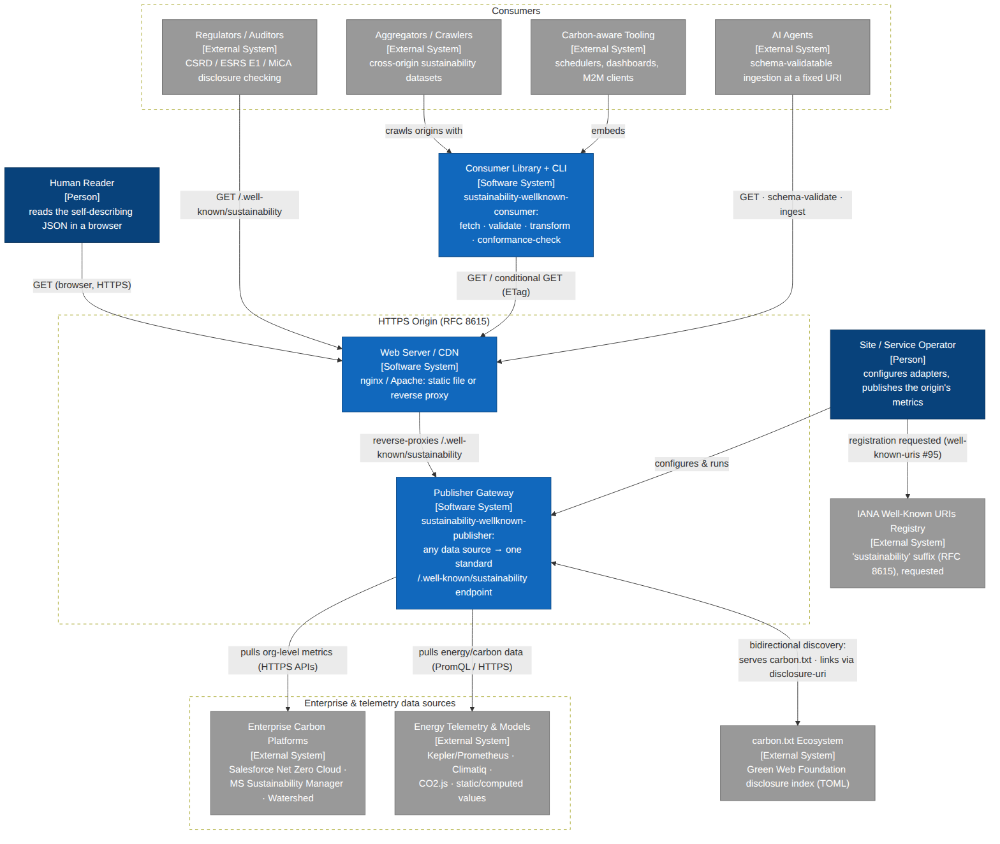

*Source: [`diagrams/c4-context.mmd`](diagrams/c4-context.mmd)* — a `graph TD`
equivalent of a C4 System Context diagram (see [Sources](#9-sources) for why).

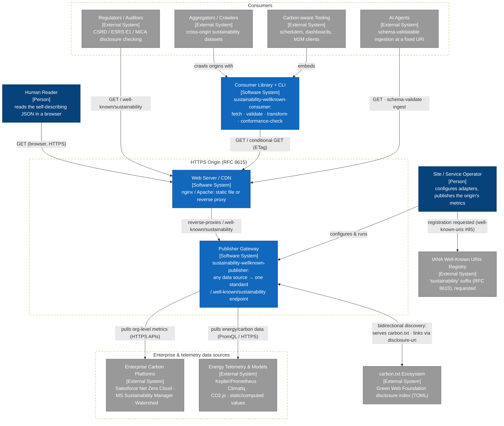

---

## 2. Container view (C4 Level 2)

In C4 terms a *container* is "an application or a data store — a separately
runnable/deployable unit" ([c4model.com/abstractions](https://c4model.com/abstractions)).
The reference implementation decomposes into:

| Container | Location | Role |
|---|---|---|
| **Source Adapters** | `publisher/src/adapters/` | 10 pluggable `SourceAdapter` factories turning any upstream into `RawMetrics` |
| **Publishing Pipeline** | `publisher/src/{normalize,security,validate,publisher}.ts` | normalize → safeguards → JTD validation gate → bounded cache + ETag |
| **HTTP Layer** | `publisher/src/{handler,server,middleware/*,cli}.ts` | one framework-agnostic handler behind a standalone server, Express/Fastify middleware, and a CLI |
| **carbon.txt Module** | `publisher/src/carbontxt.ts` | emit / parse / discover a bidirectional carbon.txt |
| **Fetch + Validate Library** | `consumer/src/{fetch,validate,schema,sentinel}.ts` | hardened one-call client with defensive validation |
| **SustainabilityClient** | `consumer/src/client.ts` | ETag-cached polling client |
| **Transforms** | `consumer/src/{transform,units}.ts` | CSV / NDJSON / flatten / aggregate |
| **sustainability-fetch CLI** | `consumer/src/cli.ts`, `consumer/bin/` | M2M fetch + `--strict` conformance battery |
| **Formal Schemas + Validators** | `schemas-validators/` | CDDL (RFC 8610) + JTD (RFC 8927) with Python/Ruby validators |
| **Web Server Deployments** | `server-configurations/` | nginx/Apache snippets: static file or reverse proxy |
| **Example Scripts** | `example-scripts/` | zero-dependency safeguards + reference request handler (Python/JS/PHP) |


*Source: [`diagrams/c4-container.mmd`](diagrams/c4-container.mmd)*

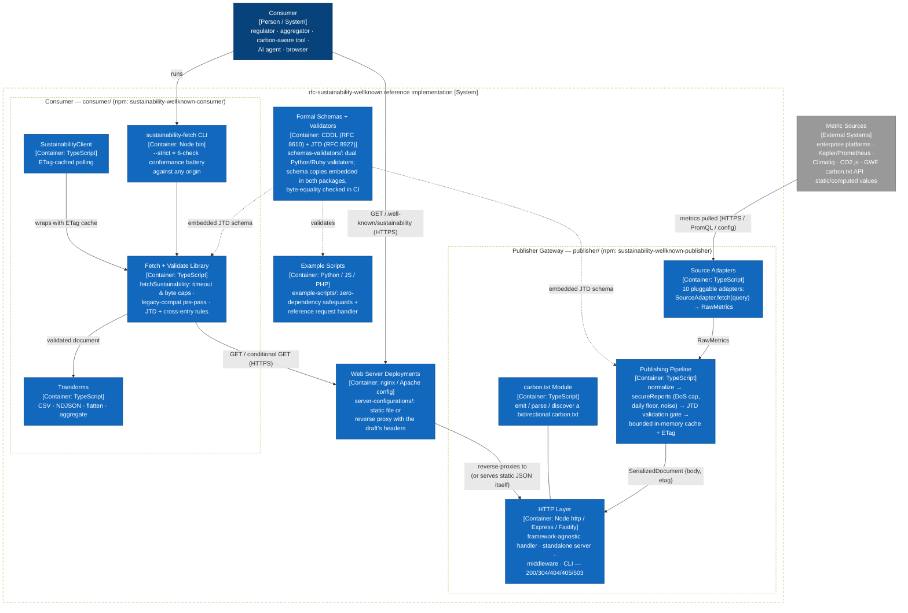

---

## 3. The protocol subsystem

The normative artifact is the Internet-Draft (`internet-drafts/`). Revision **-02**
(schema `1.1`) is the *submitted* revision — posted to the Datatracker
2026-07-03, under ISE review, frozen. Revision **-03** (schema `2.0`) is the
*prepared* revision held in this repo, to be posted when the submission window
reopens after IETF 126. The whole codebase implements the **-03 / 2.0** model,
with field-driven compatibility for historical `1.x` documents.

### 3.1 Wire-protocol lifecycle

Two service levels:

* **Basic (mandatory minimum)** — a parameterless `GET` (or `HEAD`) MUST return
  `200 OK` with a **single JSON object** covering the whole origin for the most
  recently completed period, media type `application/json`. No published data ⇒
  `404`. Any method other than GET/HEAD ⇒ `405` with `Allow: GET, HEAD`.
* **Extended (optional)** — three query parameters: `target` (path-prefix
  scoping, honored only for a deliberately published prefix set — a
  path-disclosure and cache-key-space defense), `period` (`YYYY` / `YYYY-MM` /
  `YYYY-MM-DD`), and `granularity` (`monthly` / `daily`). A granularity finer
  than the period yields a sorted **array** (trend); a `period` alone MUST
  yield a single (possibly aggregated) object. Servers that do not support the
  parameters MUST ignore them and return the Basic response — never an error.

Caching is first-class: `Cache-Control: public, max-age=86400` is recommended,
`ETag`/`Last-Modified` enable conditional requests, and the reference publisher
answers a matching `If-None-Match` with `304`. The reference publisher adds one
more state the draft implies: if the pipeline cannot produce a *valid* document,
it answers `503` rather than publish corrupt data.


*Source: [`diagrams/protocol-sequence.mmd`](diagrams/protocol-sequence.mmd)*

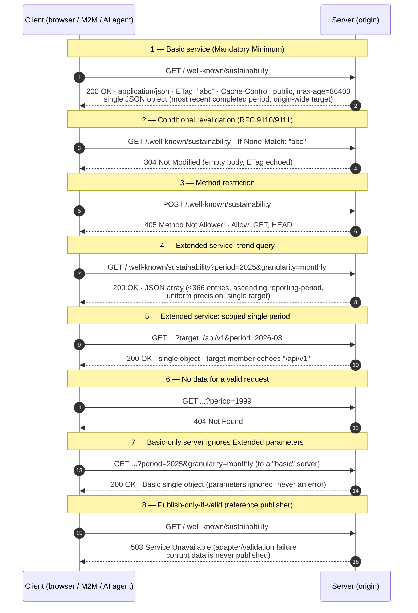

### 3.2 Data model (23 members)

A response is a single `SustainabilityMetrics` object or an array of them
(a trend). **8 members are mandatory, 15 optional** — 23 total. Since `2.0`,
*omission is the only "not reported" mechanism*: a present member always carries
a real value. Gross quantities are non-negative; `renewable-energy` is bounded
0–100 inclusive; `scope-1/2/3` **may** be negative (removals / net accounting);
absent unit members default to `kWh` and `gCO2e`; `sci-score` requires
`functional-unit`. The formal schemas are open (`additionalProperties` /
`* tstr => any`): clients MUST ignore unknown members, which is the entire
forward-compatibility story.

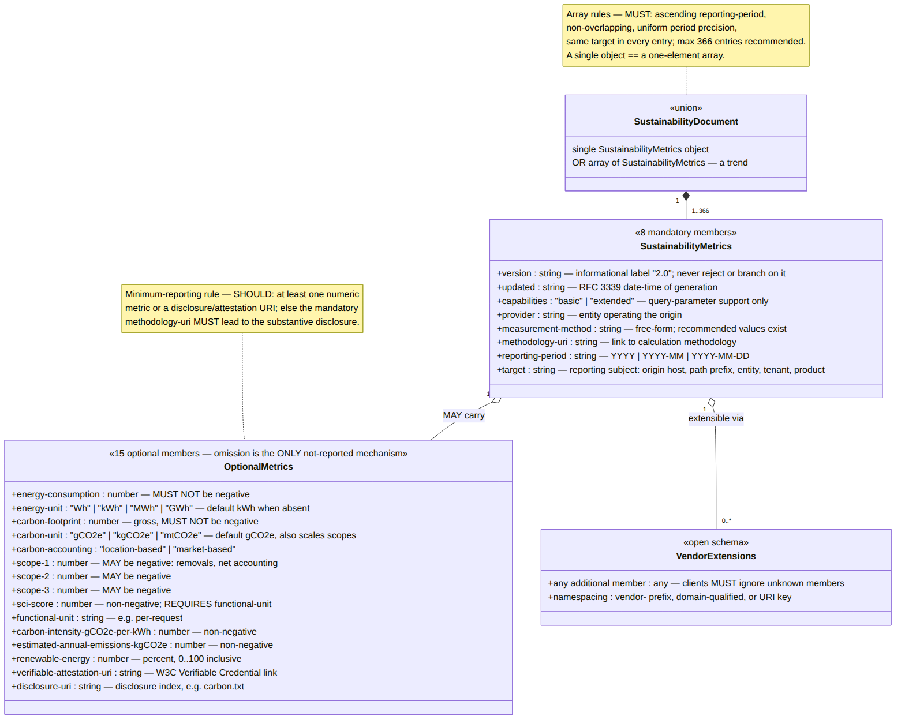

*Source: [`diagrams/data-model.mmd`](diagrams/data-model.mmd)*

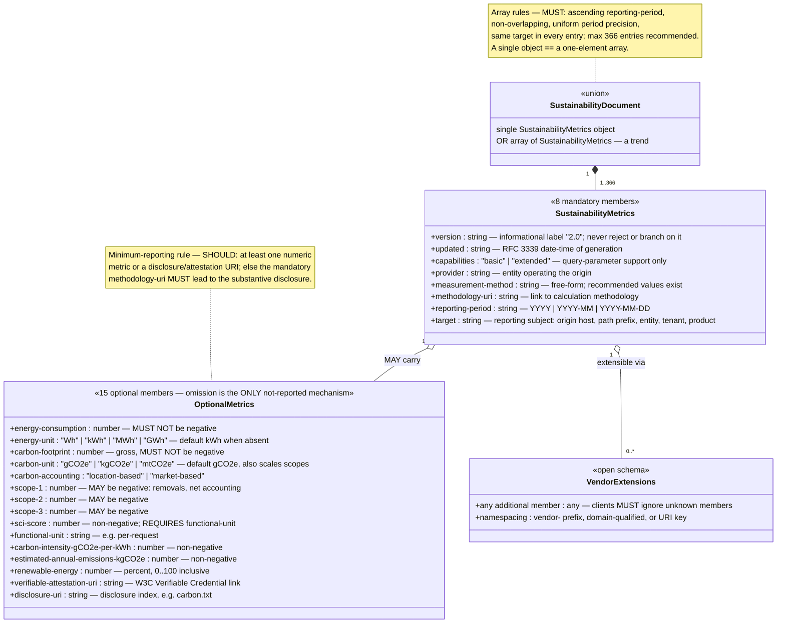

Two more prose rules complete the model:

* **Minimum-reporting rule** — a document SHOULD carry at least one numeric
  metric or a `disclosure-uri`/`verifiable-attestation-uri`; failing both, the
  mandatory `methodology-uri` MUST lead to the substantive disclosure.
* **Trust posture** — the endpoint *asserts*, it does not *verify*. Clients MUST
  NOT treat the document as proof; `verifiable-attestation-uri` (W3C Verifiable
  Credentials) and `disclosure-uri` (e.g. carbon.txt) are the composable path to
  independent verification.

### 3.3 Versioning and legacy-compatibility state logic

The `version` member is an informational label with **no negotiation
semantics** — clients MUST NOT reject or branch on it. Interop with historical
`1.0`/`1.1` documents (the submitted `-02` model: four mandatory metric members,
negative "not reported" sentinel, optional `target-path`) is achieved entirely
through two **field-driven** rules:

1. A negative value in a member defined as non-negative ⇒ treat that member as
   *not reported* (subsumes the historical sentinel).
2. A document without a `target` member ⇒ treat as an *origin-wide* report
   (what the historical absence of `target-path` conveyed).

The same diagram tracks the draft's own revision lifecycle, from the renamed
predecessor series to the ISE-reviewed `-02`, the prepared `-03`, and the
eventual Informational RFC + IANA registration.

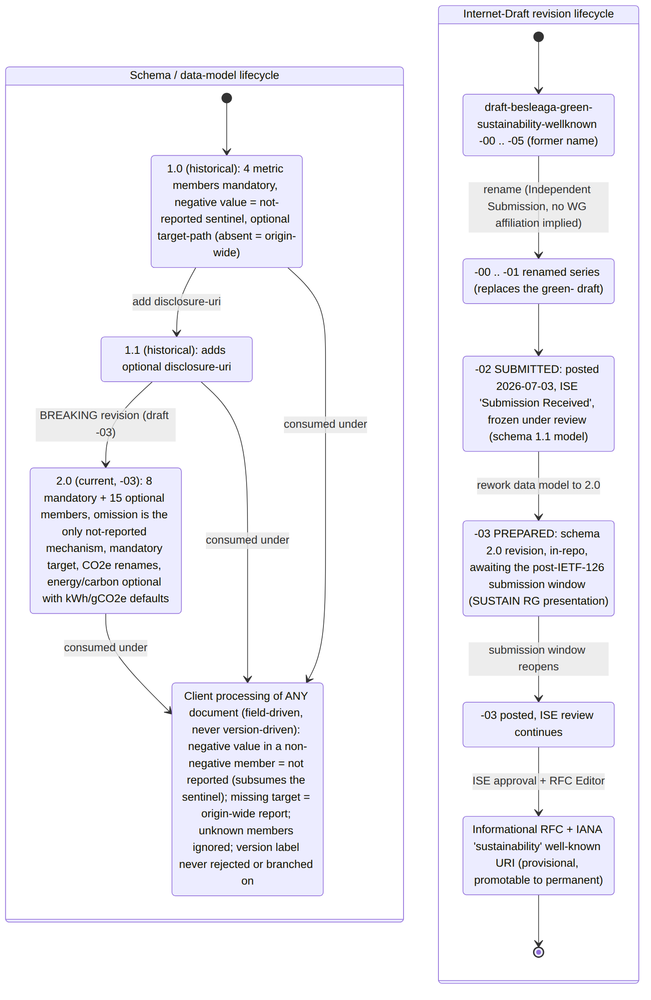

*Source: [`diagrams/version-state.mmd`](diagrams/version-state.mmd)*

```mermaid
stateDiagram-v2
    state "Schema / data-model lifecycle" as SCHEMA {
        state "1.0 (historical): 4 metric members mandatory, negative value = not-reported sentinel, optional target-path (absent = origin-wide)" as V10
        state "1.1 (historical): adds optional disclosure-uri" as V11
        state "2.0 (current, -03): 8 mandatory + 15 optional members, omission is the only not-reported mechanism, mandatory target, CO2e renames, energy/carbon optional with kWh/gCO2e defaults" as V20
        state "Client processing of ANY document (field-driven, never version-driven): negative value in a non-negative member = not reported (subsumes the sentinel); missing target = origin-wide report; unknown members ignored; version label never rejected or branched on" as COMPAT

        [*] --> V10
        V10 --> V11 : add disclosure-uri
        V11 --> V20 : BREAKING revision (draft -03)
        V20 --> COMPAT : consumed under
        V11 --> COMPAT : consumed under
        V10 --> COMPAT : consumed under
    }

    state "Internet-Draft revision lifecycle" as DRAFT {
        state "draft-besleaga-green-sustainability-wellknown -00 .. -05 (former name)" as GREEN
        state "-00 .. -01 renamed series (replaces the green- draft)" as EARLY
        state "-02 SUBMITTED: posted 2026-07-03, ISE 'Submission Received', frozen under review (schema 1.1 model)" as SUBMITTED
        state "-03 PREPARED: schema 2.0 revision, in-repo, awaiting the post-IETF-126 submission window (SUSTAIN RG presentation)" as PREPARED
        state "-03 posted, ISE review continues" as POSTED
        state "Informational RFC + IANA 'sustainability' well-known URI (provisional, promotable to permanent)" as RFC

        [*] --> GREEN
        GREEN --> EARLY : rename (Independent Submission, no WG affiliation implied)
        EARLY --> SUBMITTED
        SUBMITTED --> PREPARED : rework data model to 2.0
        PREPARED --> POSTED : submission window reopens
        POSTED --> RFC : ISE approval + RFC Editor
        RFC --> [*]
    }
```

---

## 4. Publisher subsystem — the universal gateway

`publisher/` (npm `sustainability-wellknown-publisher`) is architected as a
**universal gateway**: *any data source in, one standard endpoint out*. The
insight is that enterprises already hold sustainability data in wildly different
systems (carbon-accounting SaaS, Kubernetes energy telemetry, estimation APIs,
spreadsheets); the gateway's adapter layer flattens all of them into one
loosely-typed `RawMetrics` shape, and a single deterministic pipeline turns that
into a draft-conformant document.

**The 10 adapters** (`publisher/src/adapters/`, factory names as registered in
`cli.ts`): `static`, `static-file`, `computed`, `kepler-prometheus`, `climatiq`,
`co2js` (Green Web Foundation CO2.js, bytes → carbon, with Greencheck),
`carbontxt-api` (GWF hosted carbon.txt API), and the enterprise trio
`salesforce-nzc`, `ms-sustainability`, `watershed`. Every adapter implements the
same three-property contract: `{ name, capabilities, fetch(query) }`.

**Pipeline stages** (orchestrated by `Publisher.build()` in `publisher.ts`):

1. **`adapter.fetch(query)`** → `RawMetrics | RawMetrics[]`.
2. **`normalize()`** (`normalize.ts`) — joules→kWh and full unit conversion
   (`Wh…GWh`, `g…mtCO2e`), carbon derived from energy × grid intensity when
   absent, defaults (`version "2.0"`, `capabilities "basic"`, `updated` now),
   the mandatory `target` (adapter value or configured fallback), and hard
   errors on constraint violations (negative gross metrics, `renewable-energy`
   outside 0–100, `sci-score` without `functional-unit`, malformed periods).
3. **`secureReports()`** (`security.ts`) — the draft's operational safeguards:
   drop sub-daily entries (traffic-analysis floor), sort ascending, cap at 366
   keeping the most recent (DoS), optional deterministic ~±1% multiplicative
   noise (anti-fingerprinting; same factor per period so scopes still sum to the
   footprint and re-generation is stable for caching).
4. **Shape rule** — no `granularity` in the query ⇒ single object (most recent
   entry); granularity ⇒ array. Zero entries ⇒ `NotFoundError` ⇒ HTTP 404.
5. **JTD validation gate** (`validate.ts`) — every payload is validated against
   the embedded schema *plus* the prose rules JTD cannot express (non-negativity,
   0–100, sci↔functional-unit dependency, finite numbers, RFC 3339 `updated`,
   period shape, cross-entry array rules). Failure throws ⇒ HTTP **503**: the
   gateway never publishes corrupt data.
6. **Cache + serialize** (`publisher.ts`) — bounded in-memory cache (default TTL
   24 h, ≤256 client-controlled query variants — the bound is itself a memory-DoS
   defense) storing `{body, etag}` with a SHA-1 ETag.
7. **HTTP** (`handler.ts`) — one framework-agnostic `handleRequest()` produces
   `200/304/404/503` with `Cache-Control`, CORS and RFC 9110 `If-None-Match`
   handling; the standalone server (`server.ts`) adds `405 + Allow: GET, HEAD`
   and optional `carbon.txt` serving; Express/Fastify middleware and the CLI
   (`--once` for static generation) reuse it unchanged.

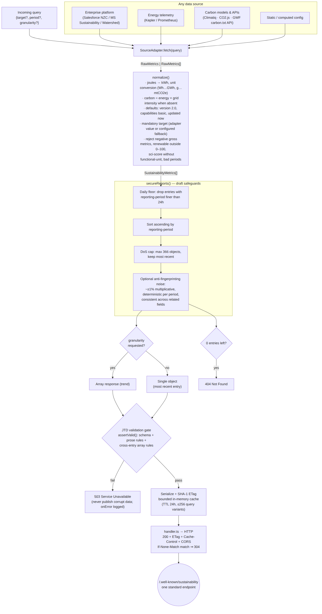

*Source: [`diagrams/gateway-flow.mmd`](diagrams/gateway-flow.mmd)*

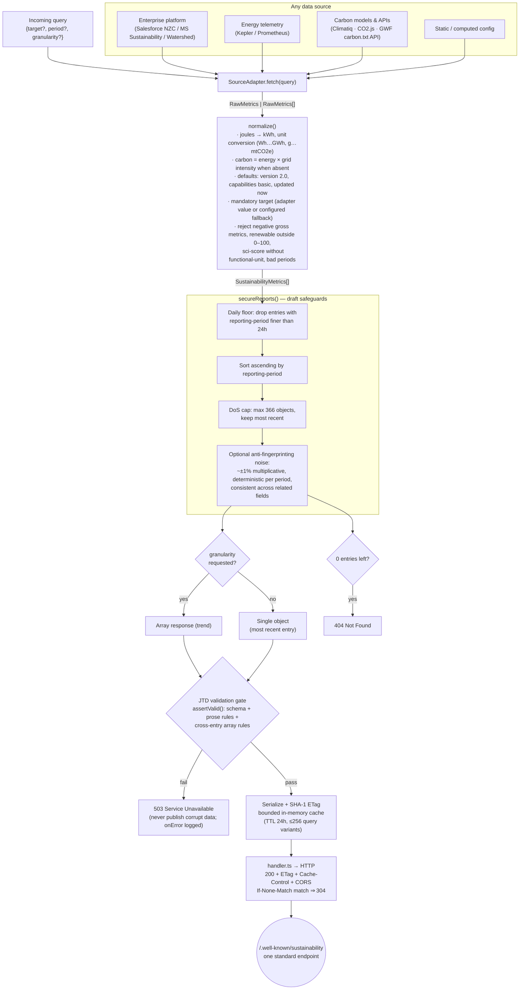

### Publisher component map (C4 Level 3)


*Source: [`diagrams/c4-component-publisher.mmd`](diagrams/c4-component-publisher.mmd)*

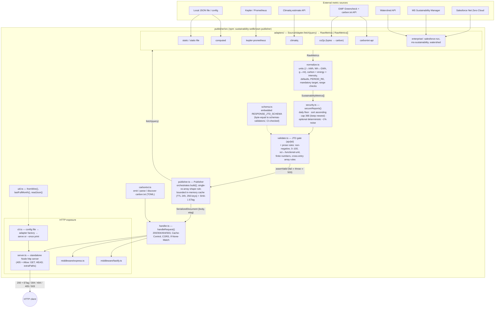

---

## 5. Consumer subsystem

`consumer/` (npm `sustainability-wellknown-consumer`) is the reference *client*:
fetch, **defensively** validate (a non-conformant upstream is the expected case
in early adoption), and transform. Three tiers:

1. **`fetchSustainability(origin, options)`** — one call, zero extra
   dependencies. Hardened against hostile origins: overall timeout (default
   30 s via `AbortSignal.timeout`), a 10 MB body cap enforced *while streaming*
   (a lying `Content-Length` cannot force buffering), JSON parse guard, then the
   validation gate. Results are a typed status union — `ok · not-modified ·
   not-found · invalid · http-error · timeout · too-large` — so callers never
   see exceptions for ordinary protocol outcomes.
2. **`SustainabilityClient`** — repeated polling with a bounded per-
   (origin + params) ETag cache; a `304` transparently replays the cached
   document; `getTrend()` asserts the array shape.
3. **CLI `sustainability-fetch`** — JSON/CSV/NDJSON output, plus `--strict`,
   which runs the **6-check conformance battery** (`conformance.ts`) against
   *any* implementation: Basic single object · `application/json` media type ·
   ETag present · fresh ETag ⇒ 304 · POST ⇒ 405 + `Allow` · granularity request
   yields a valid (sorted-array-when-honored) response. The battery deliberately
   disables the legacy-compat pre-pass so it sees the document exactly as served.

The **legacy-compat pre-pass** in `fetch.ts` implements the draft's
"missing `target` ⇒ origin-wide" rule before the schema gate: the injected host
comes from the *final* response URL (redirects MUST be attributed to the final
origin), and the result is flagged `legacy: true`. `sentinel.ts` implements the
other compatibility rule for values (out-of-range ⇒ not reported; scopes exempt),
which `transform.ts` honors when flattening and aggregating. `disclosure.ts` is
deliberately passive — disclosure/attestation URIs are never fetched
automatically (SSRF posture; the draft's "MUST NOT treat as proof").


*Source: [`diagrams/consumer-flow.mmd`](diagrams/consumer-flow.mmd)*

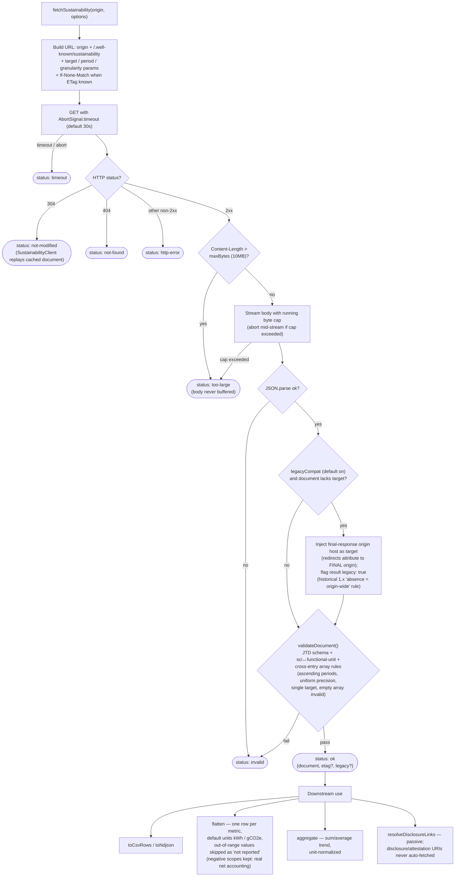

### Consumer component map (C4 Level 3)

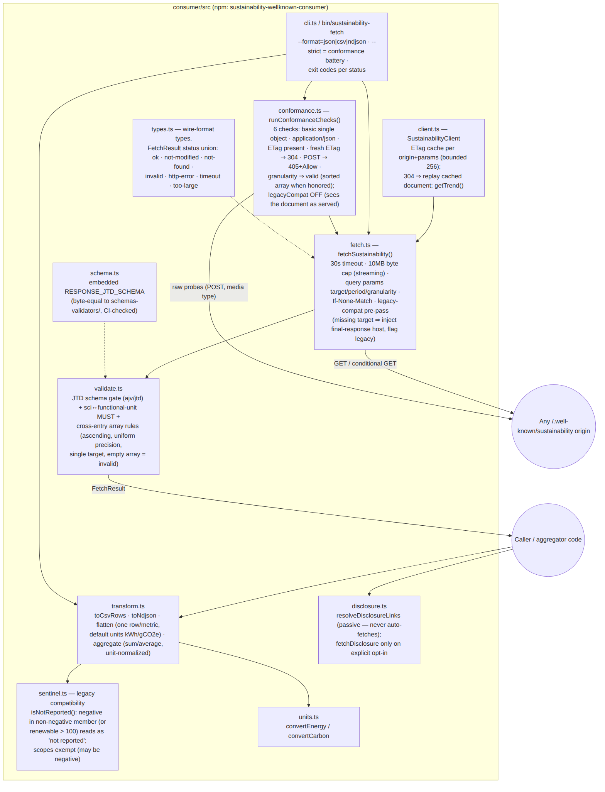

*Source: [`diagrams/c4-component-consumer.mmd`](diagrams/c4-component-consumer.mmd)*

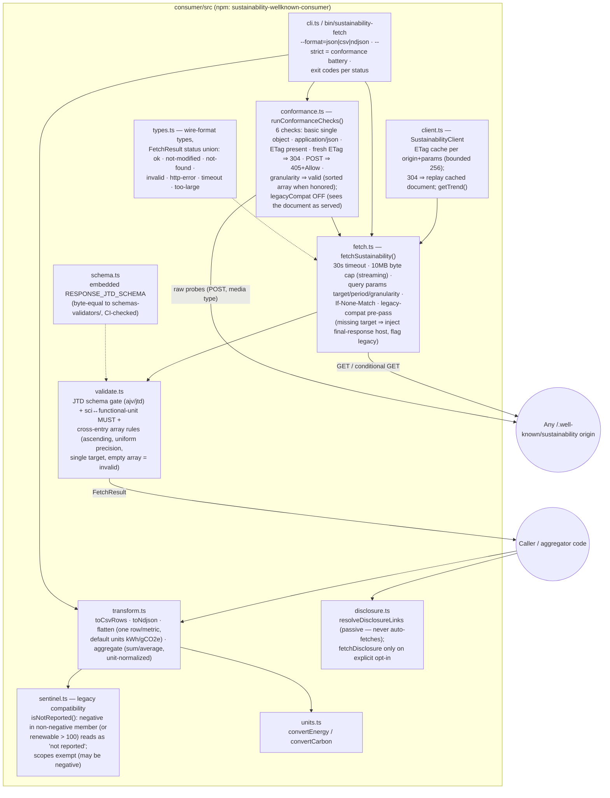

---

## 6. Deployment topologies

Because the HTTP semantics live in one framework-agnostic function
(`handleRequest` → `HandlerResult {status, headers, body}`), the same pipeline
deploys five ways. The draft only requires that `/.well-known/sustainability`
on the origin routes to *some* conformant responder:

1. **Standalone gateway** — the Node process from `server.ts`/`cli.ts` serves
   the endpoint directly (plus optional `carbon.txt` at both conventional paths).
2. **Embedded middleware** — `expressSustainability()` / `fastifySustainability()`
   mount the endpoint inside an existing app.
3. **Static file + web server** — for reports that change monthly, no runtime
   at all: generate once (`publisher --once`, or by hand, validated with
   `schemas-validators/`) and serve with the `server-configurations/` nginx
   `location` / Apache `Alias` snippets, which implement the draft's headers
   (media type, `Cache-Control`, automatic `ETag`/`Last-Modified`, CORS `*`,
   GET/HEAD-only with `405 + Allow`).
4. **Reverse proxy** — nginx/Apache/CDN in front of topology 1, proxying only
   the well-known path (with the commented rate-limiting snippets recommended
   for dynamic `period`/`granularity` queries).
5. **Serverless / edge** — any function handler that adapts its event to
   `handleRequest()`'s query/header inputs and its `HandlerResult` output.


*Source: [`diagrams/deployment.mmd`](diagrams/deployment.mmd)*

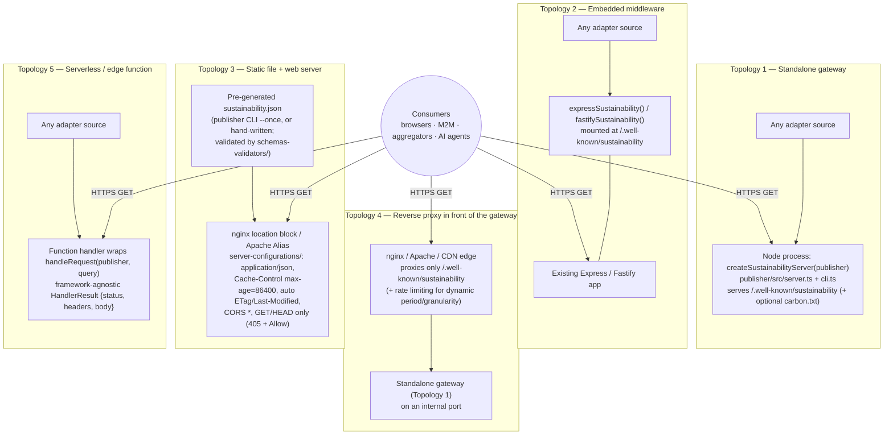

---

## 7. Supporting subsystems (schemas, example scripts, server configs)

* **`schemas-validators/`** — the single source of truth for the wire format:
  `response-schema.cddl` (RFC 8610, matches the draft's formal definition) and
  `response-schema.json` (RFC 8927 JTD). Two independent validators
  (`validator-cddl.py` via the Ruby `cddl` gem; `validator-json.py` via Python
  `jtd`) cross-check every example response. Both npm packages embed a copy of
  the JTD schema in their `schema.ts`; CI asserts **byte-equality** with the
  canonical file, so the three copies cannot drift.
* **`example-scripts/`** — zero-dependency ports of the operational safeguards
  (`security.py/.js/.php`: 366-object cap, sub-daily filter, deterministic ~1%
  noise) and a complete stdlib-only reference request handler
  (`request-handler.py`) exercising the full Basic/Extended semantics — proof
  the protocol needs no framework.
* **`server-configurations/`** — the nginx/Apache snippets used by topology 3/4,
  live-tested in CI (below).
* **`example-responses/`** — five golden documents covering every service level
  and field combination; all pass both validators.

## 8. CI / verification architecture

Six GitHub Actions workflows (`.github/workflows/`) verify each subsystem and
the whole:

| Workflow | Scope |
|---|---|
| `draft.yml` | Builds the latest draft with kramdown-rfc + xml2rfc, sanity checks, uploads the I-D artifact |
| `validate-examples.yml` | Runs both CDDL and JTD validators over every `example-responses/` file |
| `publisher.yml` | Typecheck, build, test, `npm publish --dry-run` for the publisher (path-triggered, incl. schema paths) |
| `consumer.yml` | Builds the **publisher first** (the consumer's `interop.test.ts` runs a live in-process producer→consumer round trip), then builds and tests the consumer |
| `example-scripts.yml` | Python/JS/PHP safeguard test suites |
| `full-verify.yml` | The umbrella: draft build + idnits (0 errors), dual-validator schema pass, both packages (typecheck/build/test/dry-run publish), example-script suites, **live nginx and Apache runs** of the `server-configurations/` snippets (curl-asserting 200 and `405 + Allow: GET, HEAD`), and a summary gate over all areas |

Verification is thus layered exactly like the architecture: schema conformance
at the document level (dual validators), MUST-level behavior at the HTTP level
(conformance battery + live web-server checks), and cross-package interop at the
system level (the consumer validating what the publisher actually serves) — the
same JTD schema enforced, byte-identically, at every layer.

---

## 9. Sources

* **C4 model** — Simon Brown, [c4model.com](https://c4model.com/): the
  hierarchical *System Context → Container → Component → Code* abstraction
  levels used here; definitions per
  [c4model.com/abstractions](https://c4model.com/abstractions) ("a **container**
  is an application or a data store — a separately runnable/deployable unit";
  a **component** is "a grouping of related functionality" within a container;
  **people** "use the software systems that we build"). The C4 model is
  notation-independent, which is why flowchart renderings of C4 levels are
  legitimate C4 diagrams.
* **Mermaid** — [mermaid.js.org](https://mermaid.js.org/): `flowchart`,
  `sequenceDiagram`, `classDiagram`, `stateDiagram-v2` syntax, and the
  [C4 diagram syntax](https://mermaid.js.org/syntax/c4.html), which Mermaid
  documents as **experimental** ("the syntax and properties can change in future
  releases"). Levels 1–2 were first authored in native `C4Context`/`C4Container`
  syntax; the experimental layout produced overlapping labels and unreadable
  stacking at this element count, so they were rewritten as `graph TD`
  equivalents styled with the standard C4 colour conventions (dark blue person /
  blue system-in-scope / grey external / dashed boundaries).
* Diagrams rendered with
  [`@mermaid-js/mermaid-cli`](https://github.com/mermaid-js/mermaid-cli)
  (`mmdc -s 2 -b white`).
* **Repository ground truth** — the `-03` draft, root `README.md`,
  `publisher/src/`, `consumer/src/`, `schemas-validators/`,
  `server-configurations/`, `example-scripts/`, and `.github/workflows/` as
  cited throughout.

## Directory map

```
architecture/
├── README.md                          # this document
├── diagrams/                          # Mermaid sources (one per diagram)
│   ├── c4-context.mmd                 # C4 L1 — system context
│   ├── c4-container.mmd               # C4 L2 — containers
│   ├── c4-component-publisher.mmd     # C4 L3 — publisher/src
│   ├── c4-component-consumer.mmd      # C4 L3 — consumer/src
│   ├── protocol-sequence.mmd          # wire-protocol lifecycle
│   ├── gateway-flow.mmd               # universal-gateway pipeline
│   ├── consumer-flow.mmd              # consumer fetch/validate/transform
│   ├── data-model.mmd                 # 23-member document model
│   ├── version-state.mmd              # schema + draft revision lifecycles
│   └── deployment.mmd                 # five deployment topologies
└── images/                            # rendered PNGs (same basenames)
```
